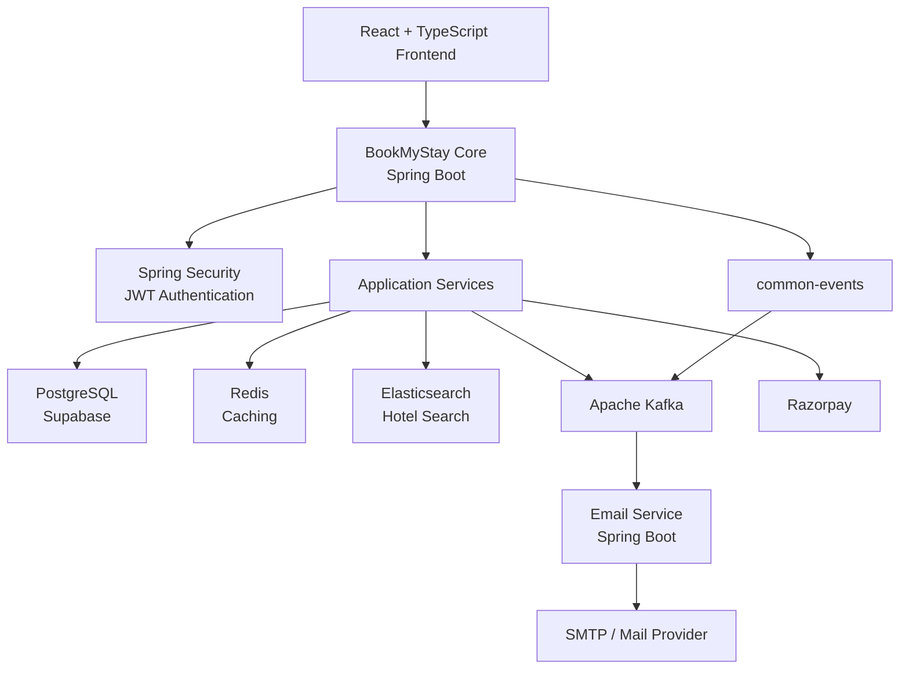
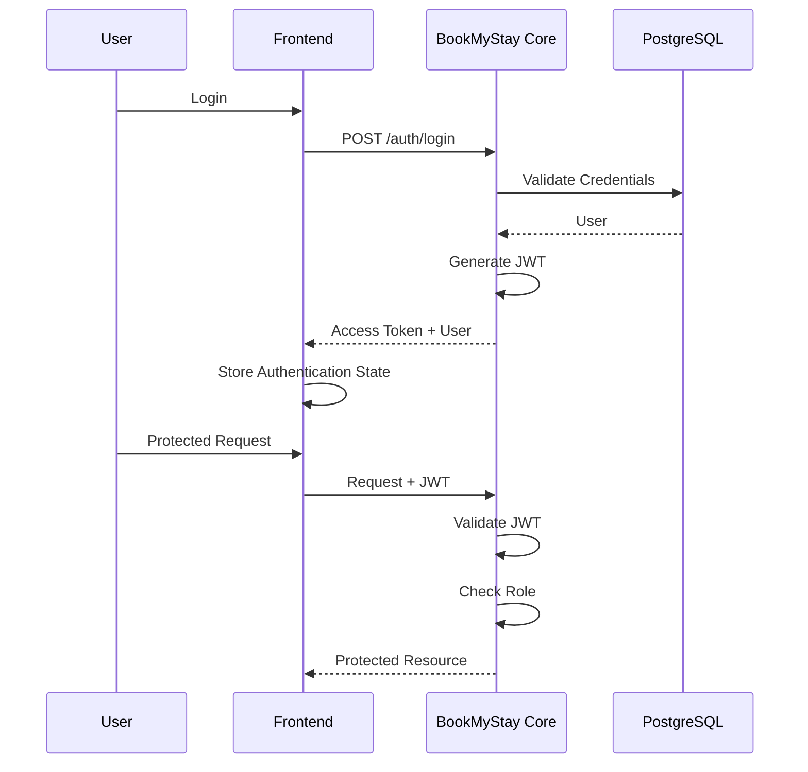
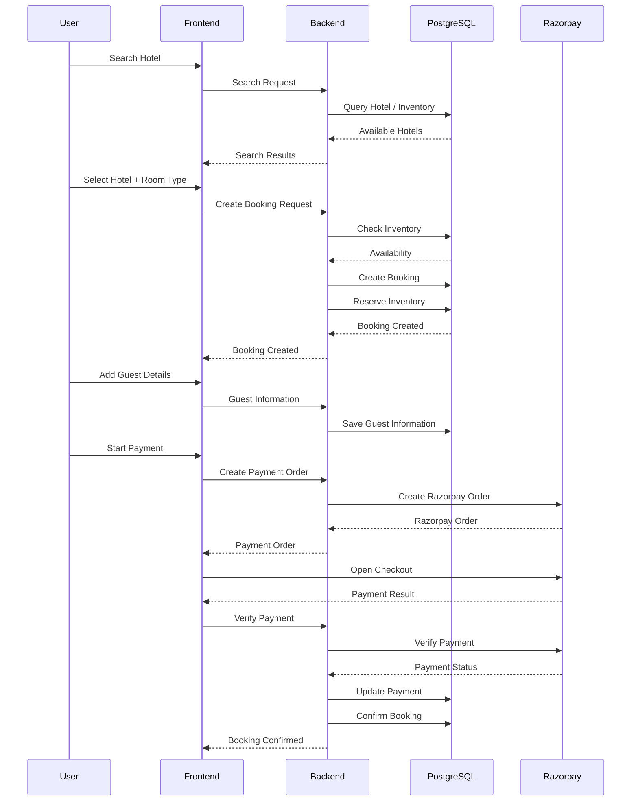
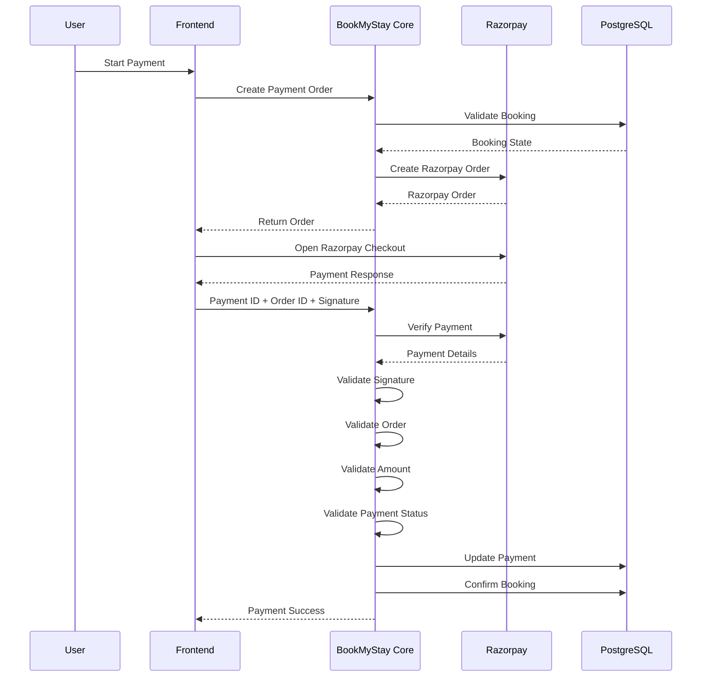
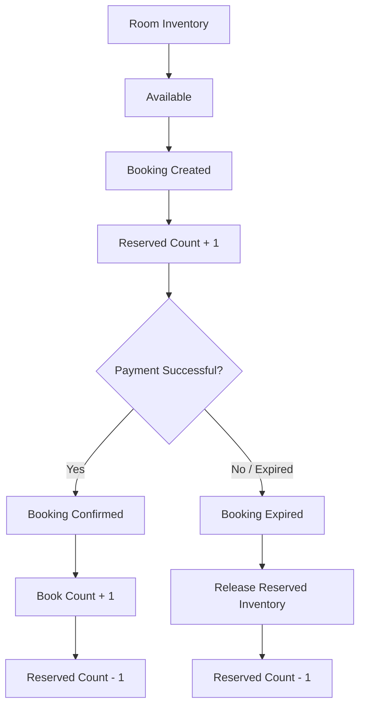
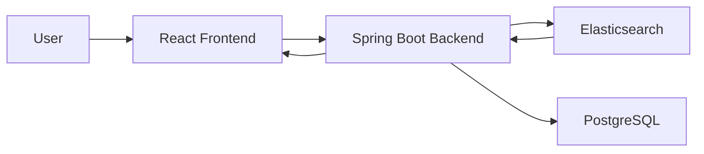
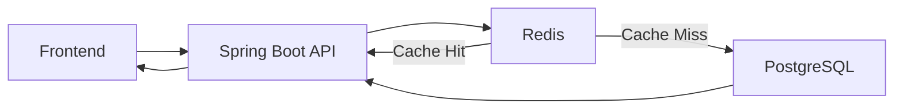
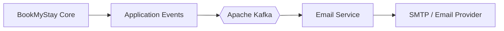
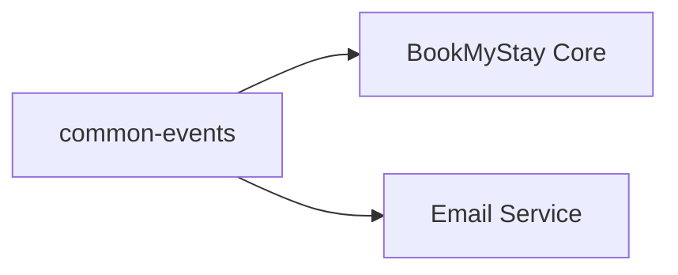

# 🏨 BookMyStay — Hotel Booking Platform

<p align="center">
  
  
  
  
  
  
  
  
</p>

<p align="center">
  <b>A full-stack hotel booking platform built with Java, Spring Boot, PostgreSQL, Redis, Elasticsearch, Kafka and Razorpay.</b>
</p>

<p align="center">
  <a href="https://github.com/gittarsem/BookMyStay">Backend</a>
  •
  <a href="https://github.com/gittarsem/BookMyStay-Frontend">Frontend</a>
</p>

---

## 📌 Overview

**BookMyStay** is a full-stack hotel booking platform designed to provide a complete hotel reservation ecosystem for:

- 👤 Guests
- 🏨 Hotel Owners
- 🛡️ Administrators

The platform covers the complete hotel booking lifecycle — from hotel discovery and room selection to inventory reservation, guest management, payment processing, booking confirmation, reviews and email notifications.

The backend is built using **Java 21 and Spring Boot** with a modular architecture and event-driven communication using **Apache Kafka**.

---

## ✨ Key Features

### 👤 Guest Features

- User registration and login
- JWT-based authentication
- Hotel search
- City-based hotel discovery
- Room type selection
- Guest-based room selection
- Inventory availability checking
- Dynamic room pricing
- Booking creation
- Inventory reservation
- Guest information management
- Razorpay payment integration
- Payment verification
- Booking confirmation
- Booking history
- Booking details
- Booking cancellation
- Review and rating system
- Email notifications

### 🏨 Hotel Owner Features

- Owner registration/application
- Hotel creation and management
- Room management
- Room type management
- Inventory management
- Room pricing management
- Booking management
- Revenue tracking
- Review management
- Owner verification workflow
- Verification resubmission
- Owner settings

### 🛡️ Admin Features

- Admin dashboard
- User management
- Hotel management
- Owner management
- Hotel verification
- Owner verification
- Platform-level monitoring
- Administrative controls

---

## 🏗️ System Architecture



---

## 🧩 Technology Stack

| Layer | Technology | Purpose |
|---|---|---|
| Language | Java 21 | Backend development |
| Framework | Spring Boot 3 | REST APIs and application services |
| Security | Spring Security | Authentication and authorization |
| Authentication | JWT | Stateless authentication |
| ORM | Spring Data JPA | Database persistence |
| Database | PostgreSQL | Primary relational database |
| Database Hosting | Supabase | Hosted PostgreSQL |
| Cache | Redis | Caching |
| Search | Elasticsearch | Hotel search |
| Messaging | Apache Kafka | Event-driven communication |
| Email | JavaMailSender | Email notifications |
| Payments | Razorpay | Online payments |
| API Documentation | Swagger / OpenAPI | API documentation |
| Containerization | Docker | Application and infrastructure containers |
| Frontend | React + TypeScript | User interface |
| Build Tool | Maven | Java dependency and build management |

---

## 🔐 Authentication & Authorization

BookMyStay uses **Spring Security with JWT-based authentication**.

The platform supports role-based access control.

### Application Roles

```text
USER
OWNER
ADMIN
```

### Authentication Flow



---

# 🏨 Hotel Booking

The booking system is designed around:

- Hotel
- Room Type
- Guest Capacity
- Inventory Availability
- Check-in Date
- Check-out Date
- Adult Count
- Child Count

A booking request contains:

```text
Hotel
Room Type
Check-in Date
Check-out Date
Adults
Children
```

The backend validates room capacity and inventory availability before creating the booking.

---

## 🔄 Booking Flow



Detailed documentation:

**[📖 Booking Flow](docs/BOOKING-FLOW.md)**

---

# 💳 Payment Processing

BookMyStay integrates **Razorpay** for online payments.

The backend validates:

- Razorpay payment status
- Razorpay order ID
- Payment amount
- Payment information
- Payment signature

## Payment Flow



Detailed documentation:

**[💳 Payment Flow](docs/PAYMENT-FLOW.md)**

---

# 📦 Inventory Management

BookMyStay maintains daily room inventory.

Inventory tracks information such as:

```text
Room
Hotel
City
Date
Book Count
Reserved Count
Total Count
Surge Factor
Price
Closed
```

### Availability Calculation

```text
Available Rooms
=
Total Count
-
Book Count
-
Reserved Count
```

This allows the system to reserve inventory while a booking is going through the payment process.

## Inventory Lifecycle



---

# 🔎 Elasticsearch Search

Elasticsearch is used for hotel search functionality.

The hotel search document contains information such as:

```text
Hotel ID
Hotel Name
City
Price
Ratings
Review Count
Active Status
Thumbnail
```

## Search Architecture



---

# ⚡ Redis

Redis is used as a caching layer to reduce unnecessary repeated database operations and improve application performance.



---

# 📨 Event-Driven Architecture

BookMyStay uses **Apache Kafka** for asynchronous event processing.

The core backend publishes application events that can be consumed by independent services.



## Shared Events

The `common-events` module contains shared event definitions used by the backend and email service.



Detailed documentation:

**[📨 Event-Driven Architecture](docs/EVENT-DRIVEN-ARCHITECTURE.md)**

---

# 📧 Email Service

BookMyStay contains a separate email service responsible for processing notification events and sending emails.

```text
BookMyStay Core
       │
       ▼
    Kafka
       │
       ▼
 Email Service
       │
       ▼
 JavaMailSender
       │
       ▼
 SMTP Provider
       │
       ▼
    User Email
```

### Responsibilities

- Consume Kafka events
- Process notification events
- Build email messages
- Send emails using JavaMailSender

The email service is independently structured and can be deployed separately from the core backend.

---

# 🗄️ Database

The application uses **PostgreSQL** as its primary relational database.

The project uses **Supabase PostgreSQL** for hosted database infrastructure.

Major domain areas include:

```text
Users
Hotels
Rooms
Inventory
Bookings
Payments
Guests
Reviews
```

Detailed database documentation:

**[🗄️ Database Documentation](docs/DATABASE.md)**

---

# 🐳 Docker

The backend repository contains Docker configuration for application infrastructure.

```text
Dockerfile
docker-compose.yml
email-service/Dockerfile
```

The Docker Compose configuration is used for infrastructure such as:

- Apache Kafka
- Elasticsearch

## Start Infrastructure

```bash
docker compose up -d
```

## Check Running Containers

```bash
docker ps
```

## Stop Infrastructure

```bash
docker compose down
```

---

# 🚀 Local Development

## 1. Clone the Repository

```bash
git clone https://github.com/gittarsem/BookMyStay.git
cd BookMyStay
```

## 2. Start Infrastructure

```bash
docker compose up -d
```

## 3. Build the Project

```bash
mvn clean install
```

## 4. Run BookMyStay Core

```bash
cd bookmystay-core
mvn spring-boot:run
```

## 5. Run Email Service

Open another terminal:

```bash
cd email-service
mvn spring-boot:run
```

---

# ⚙️ Environment Configuration

The application requires environment-specific configuration for external services.

Typical configuration categories include:

```text
PostgreSQL / Supabase
JWT
Redis
Elasticsearch
Kafka
Razorpay
SMTP
```

Create the required environment variables according to your local or deployment configuration.

> ⚠️ Never commit production secrets, passwords, API keys, JWT secrets, Razorpay credentials or SMTP credentials to GitHub.

---

# 📚 API Documentation

The backend exposes REST APIs through Spring Boot.

Swagger/OpenAPI is used for API exploration and documentation.

When the backend is running locally, Swagger UI is available through the configured Swagger endpoint:

```text
/swagger-ui/index.html
```

---

# 👥 Application Roles

## 👤 Guest

Guests can:

```text
Register
Login
Search Hotels
View Hotels
Select Rooms
Create Bookings
Add Guests
Make Payments
View Bookings
Cancel Bookings
Write Reviews
```

## 🏨 Hotel Owner

Owners can:

```text
Apply as Owner
Create Hotels
Manage Hotels
Manage Rooms
Manage Inventory
Manage Bookings
View Revenue
Manage Reviews
Manage Verification
```

## 🛡️ Administrator

Administrators can:

```text
View Dashboard
Manage Users
Manage Hotels
Review Owner Applications
Verify Hotels
Manage Platform Data
```

---

# 🔄 Booking States

The booking lifecycle includes states such as:

```text
payment_pending
      │
      ├── Payment Successful
      │        ↓
      │      Booked
      │
      └── Payment Failed / Expired
               ↓
           Cancelled
```

---

# 💳 Payment States

Payment processing supports states such as:

```text
pending
completed
failed
expired
refund
```

Payment status and booking status are maintained separately so that payment processing remains independent from the booking lifecycle.

---

# 🔒 Security

The application uses several security mechanisms:

- Spring Security
- JWT authentication
- Role-based authorization
- Password hashing
- Protected APIs
- Payment signature verification
- Environment-based secret configuration

Sensitive values should always be stored using environment variables or secure secret management.

---

# 📈 Scalability

The architecture separates major infrastructure responsibilities:

```text
                    ┌────────────────────┐
                    │   React Frontend   │
                    └─────────┬──────────┘
                              │
                              ▼
                    ┌────────────────────┐
                    │   Spring Boot API  │
                    └─────────┬──────────┘
                              │
             ┌────────────────┼─────────────────┐
             │                │                 │
             ▼                ▼                 ▼
       PostgreSQL           Redis         Elasticsearch
             │
             │
             ▼
           Kafka
             │
             ▼
       Email Service
```

This architecture allows individual infrastructure components and asynchronous services to evolve independently.

---

# 🛣️ Future Improvements

Potential future improvements include:

- Advanced hotel filtering
- Hotel recommendation engine
- Advanced dynamic pricing
- Improved inventory locking
- Payment webhooks
- Distributed tracing
- Centralized logging
- Monitoring and observability
- Rate limiting
- API gateway
- Service discovery
- Automated CI/CD
- Kubernetes deployment
- Horizontal service scaling
- Advanced analytics
- SMS notifications
- Push notifications

---

# 📸 Application Preview

> Add your actual screenshots to `docs/screenshots/` and update the filenames below.

## 🏠 Home Page


## 🔎 Hotel Search


## 🏨 Hotel Details


## 📅 Booking


## 💳 Payment


## 👤 My Bookings


## 🏨 Owner Dashboard


## 🛡️ Admin Dashboard


Complete page documentation:

**[📸 Pages & Screenshots](docs/PAGES.md)**

---

# 🗂️ Repository Structure

```text
BookMyStay/
│
├── bookmystay-core/
│   ├── src/
│   └── pom.xml
│
├── common-events/
│   ├── src/
│   └── pom.xml
│
├── email-service/
│   ├── src/
│   ├── Dockerfile
│   └── pom.xml
│
├── docs/
│   ├── ARCHITECTURE.md
│   ├── DATABASE.md
│   ├── BOOKING-FLOW.md
│   ├── PAYMENT-FLOW.md
│   ├── EVENT-DRIVEN-ARCHITECTURE.md
│   ├── DEPLOYMENT.md
│   ├── DEMO.md
│   ├── PAGES.md
│   └── screenshots/
│
├── Dockerfile
├── docker-compose.yml
├── pom.xml
└── README.md
```

---

# 📖 Project Documentation

| Document | Description |
|---|---|
| [🏗️ Architecture](docs/ARCHITECTURE.md) | Complete backend architecture |
| [🗄️ Database](docs/DATABASE.md) | Database structure and relationships |
| [🔄 Booking Flow](docs/BOOKING-FLOW.md) | Complete booking lifecycle |
| [💳 Payment Flow](docs/PAYMENT-FLOW.md) | Razorpay payment lifecycle |
| [📨 Event-Driven Architecture](docs/EVENT-DRIVEN-ARCHITECTURE.md) | Kafka and email service |
| [🚀 Deployment](docs/DEPLOYMENT.md) | Deployment architecture and setup |
| [🔑 Demo](docs/DEMO.md) | Demo accounts and testing |
| [📸 Pages](docs/PAGES.md) | Application pages and screenshots |

---

# 🖥️ Frontend

The BookMyStay frontend is maintained in a separate repository.

### Frontend Repository

https://github.com/gittarsem/BookMyStay-Frontend

### Frontend Stack

- React 19
- TypeScript
- Vite
- Tailwind CSS
- React Query
- React Hook Form
- Zod
- Axios
- Lucide Icons
- Razorpay JavaScript SDK

---

# 🌐 Repositories

### Backend

https://github.com/gittarsem/BookMyStay

### Frontend

https://github.com/gittarsem/BookMyStay-Frontend

---

# 👨‍💻 Author

**Tarsem Gulab**

B.Tech — Computer Science & Engineering

**IIIT Una**

---

# ⭐ Support

If you find this project useful or interesting, consider giving the repository a ⭐ on GitHub.

---

<p align="center">
  <b>BookMyStay — Discover. Book. Stay.</b>
</p>
