# BookMyStay — Hotel Booking Platform

<p align="center">
  
  
  
  
  
  
  
  
</p>

<p align="center">
  <b>Discover. Book. Stay.</b>
</p>

<p align="center">
  A full-stack hotel booking platform for guests, hotel owners, and administrators.
</p>

<p align="center">
  <a href="https://bookmystay-frontend-one.vercel.app">Live</a>
  •
  <a href="https://github.com/gittarsem/BookMyStay">Backend</a>
  &nbsp;•&nbsp;
  <a href="https://github.com/gittarsem/BookMyStay-Frontend">Frontend</a>
  &nbsp;•&nbsp;
  <a href="https://bookmystay-frontend-one.vercel.app">Live Frontend</a>
</p>

---

# Contents

- [ What is BookMyStay?](#-what-is-bookmystay)
- [ Application Preview](#-application-preview)
- [ What Can You Do?](#-what-can-you-do)
- [ Who Uses BookMyStay?](#-who-uses-bookmystay)
- [ How Booking Works](#-how-booking-works)
- [ How Payment Works](#-how-payment-works)
- [ What Can Hotel Owners Do?](#-what-can-hotel-owners-do)
- [️ What Can Administrators Do?](#-what-can-administrators-do)
- [ How the Platform Works](#-how-the-platform-works)
- [️ Technology Stack](#-technology-stack)
- [ Authentication & Authorization](#-authentication--authorization)
- [ Inventory Management](#-inventory-management)
- [ Hotel Search](#-hotel-search)
- [ Redis Caching](#-redis-caching)
- [ Event-Driven Architecture](#-event-driven-architecture)
- [ Email Service](#-email-service)
- [️ Database](#-database)
- [ Docker](#-docker)
- [ Run Locally](#-run-locally)
- [️ Environment Configuration](#-environment-configuration)
- [ API Documentation](#-api-documentation)
- [ Security](#-security)
- [ Scalability](#-scalability)
- [ Project Documentation](#-project-documentation)
- [️ Frontend](#️-frontend)
- [️ Future Improvements](#️-future-improvements)
- [‍ Author](#-author)

---

# What is BookMyStay?

**BookMyStay** is a full-stack hotel booking platform designed to cover the complete hotel reservation experience — from discovering a hotel to completing a booking and managing the stay.

It supports three major user groups:

-  **Guests** — discover hotels, book rooms, pay, manage bookings, and leave reviews.
-  **Hotel Owners** — create and manage properties, rooms, inventory, bookings, pricing, and revenue.
- ️ **Administrators** — manage users, hotels, and owner verification across the platform.

The platform combines a modern web interface with a Java/Spring Boot backend, PostgreSQL, Redis, Elasticsearch, Kafka, Razorpay, Docker, and a dedicated email service.

---

# Application Preview

> Add your actual screenshots to `docs/screenshots/` and keep the filenames below.

## Home


## Hotel Search

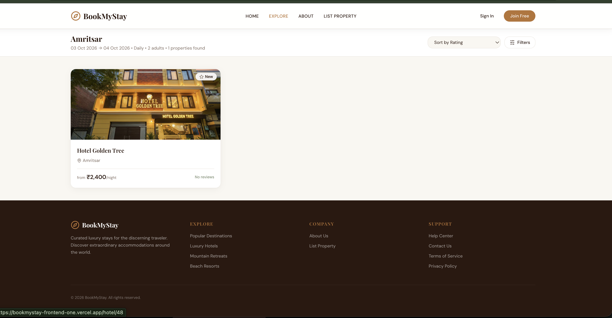

## Hotel Details

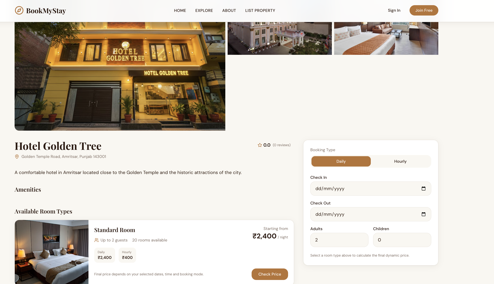

## Booking

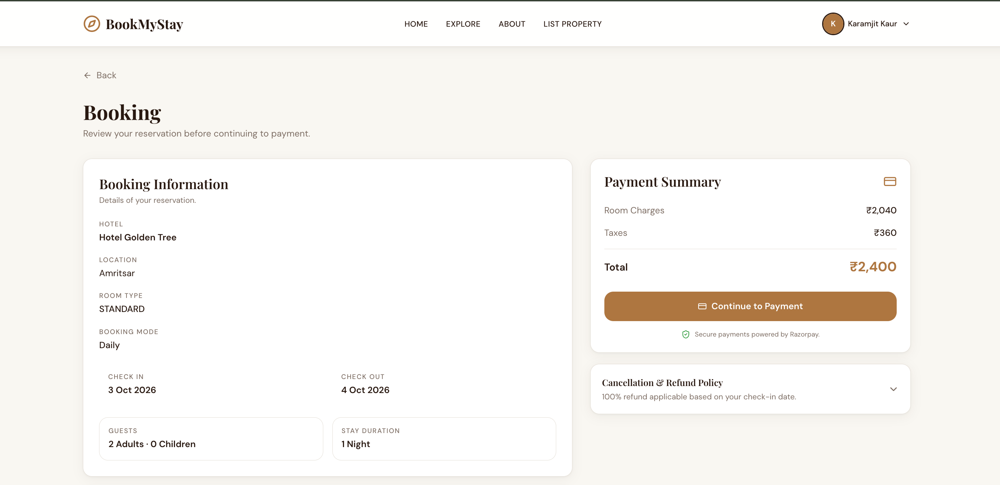

## Payment

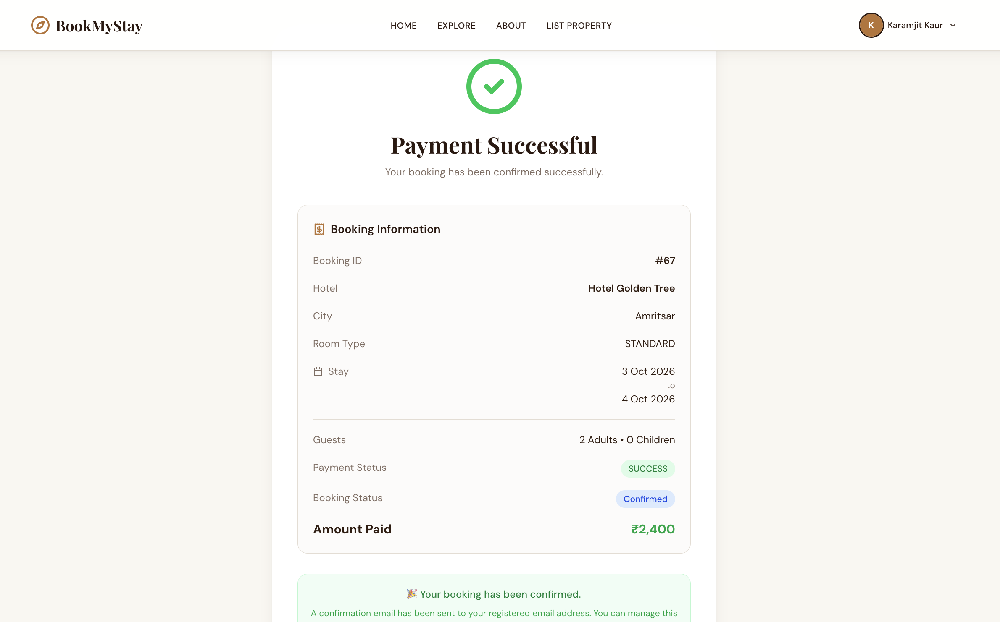

## My Bookings

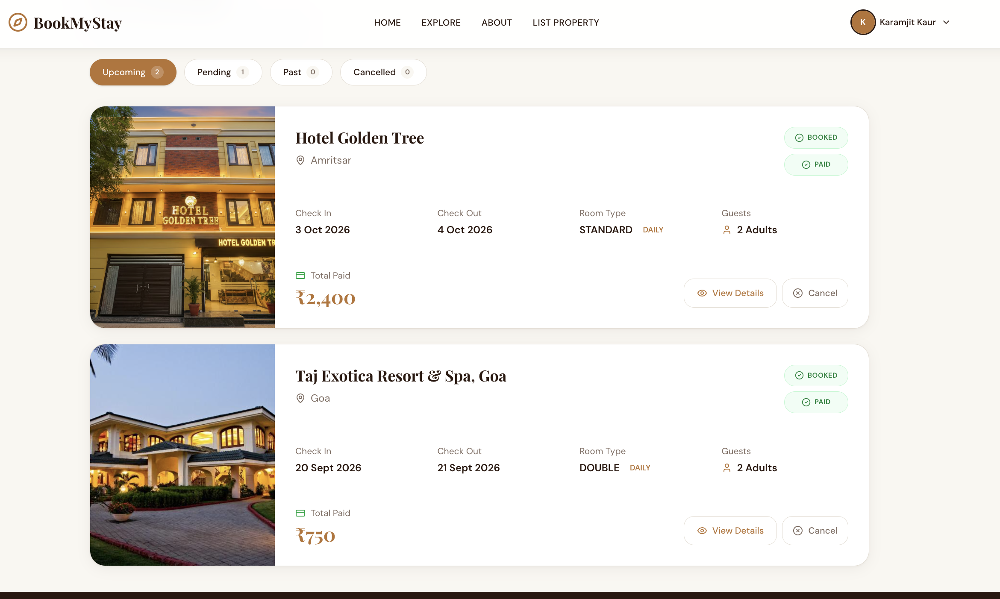

## Owner Dashboard

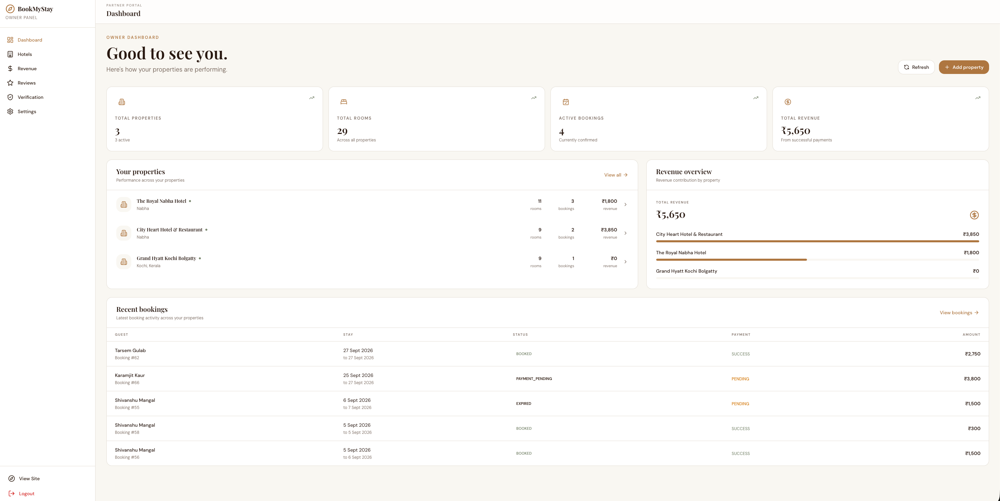

## ️ Admin Dashboard

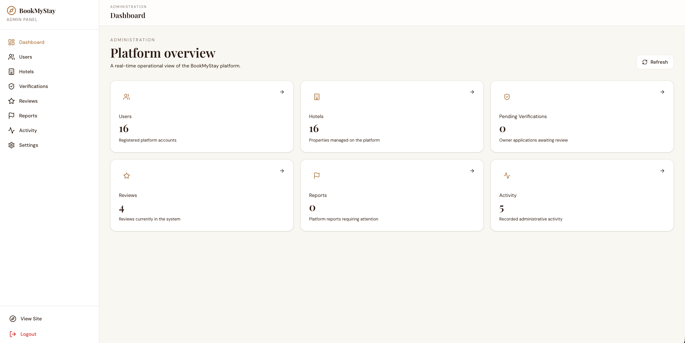

For the complete application page gallery, see [ Pages & Screenshots](docs/PAGES.md).

---

# What Can You Do?

## As a Guest

A guest can:

- Create an account and log in
- Search hotels by city
- Explore hotel details
- Select a room type based on guest capacity
- Check inventory availability
- Create a booking
- Add guest information
- Pay securely through Razorpay
- Receive booking confirmation
- View booking history and details
- Cancel bookings where supported
- Write and manage reviews
- Receive email notifications

## As a Hotel Owner

An approved owner can:

- Apply to become an owner
- Create and manage hotels
- Manage rooms and room types
- Manage inventory
- Manage room pricing
- View and manage bookings
- Track revenue
- Manage reviews
- Complete owner verification
- Resubmit verification information when required
- Manage owner settings

## ️ As an Administrator

Administrators can:

- Access the admin dashboard
- Manage users
- Manage hotels
- Review owner applications
- Verify hotels and owners
- Manage platform-level data and controls

---

# Who Uses BookMyStay?

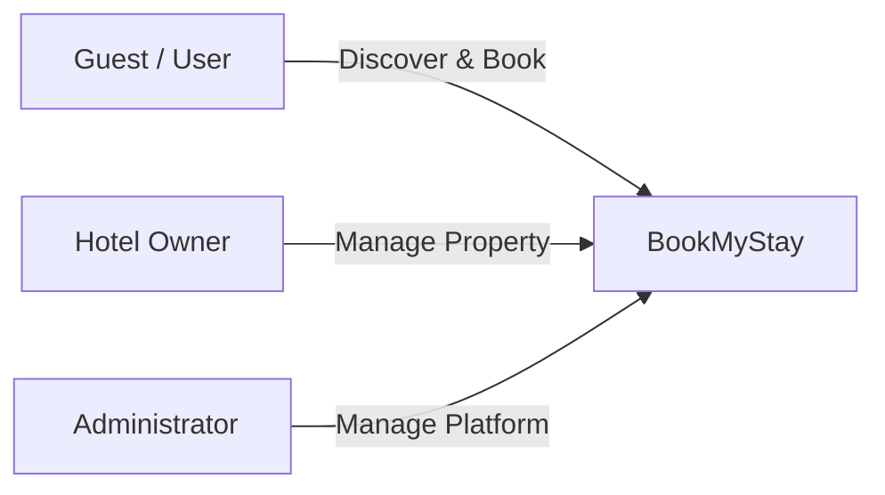

## Guest → Owner Journey

A normal user can enter the owner workflow by applying to become an owner.

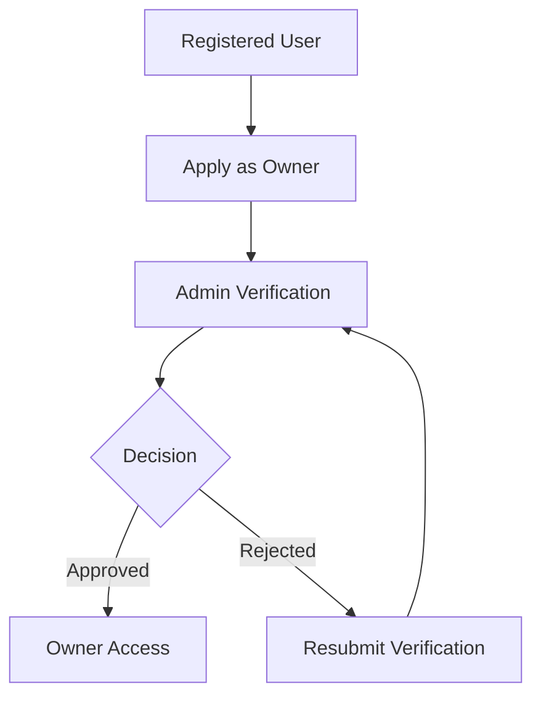

The backend remains responsible for the actual authorization and verification decision.

---

# How Booking Works

The booking experience is designed around the hotel, room type, guest count, dates, and available inventory.

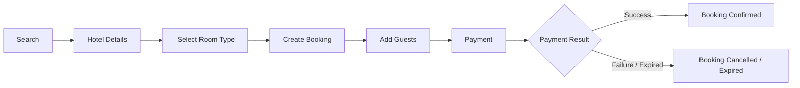

At booking creation, the backend validates room capacity and inventory availability before reserving inventory.

For the detailed backend sequence, see [ Booking Flow](docs/BOOKING-FLOW.md).

---

# How Payment Works

BookMyStay uses **Razorpay** for online payments.

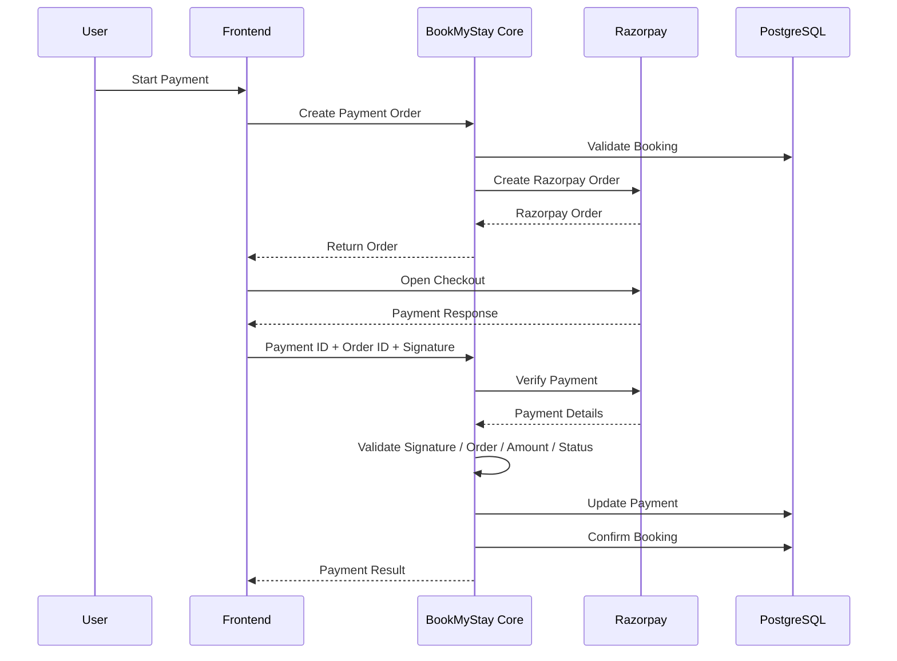

The backend verifies:

- Payment status
- Razorpay order ID
- Payment amount
- Payment information
- Payment signature

Detailed documentation: [ Payment Flow](docs/PAYMENT-FLOW.md).

---

# What Can Hotel Owners Do?

The owner experience is focused on running a hotel property through the platform.

```text
Owner Dashboard
      │
      ├──  Hotels
      ├── ️ Rooms
      ├──  Inventory
      ├──  Bookings
      ├──  Revenue
      ├── ⭐ Reviews
      ├──  Verification
      └── ️ Settings
```

Owners can create their property, configure rooms, manage availability and pricing, monitor bookings, and view revenue.

---

# ️ What Can Administrators Do?

The admin portal provides platform-level controls.

```text
Admin Dashboard
      │
      ├──  Users
      ├──  Hotels
      ├──  Owner Verification
      └── ️ Platform Administration
```

The administrator is responsible for platform-level management rather than normal guest booking operations.

---


# Booking Confirmation & Customer Communication

BookMyStay also provides customer-facing booking documents and email communication after a successful reservation.

## Booking Voucher

The platform generates a hotel booking voucher containing key reservation and payment information, including:

- Booking ID
- Hotel
- Check-in and check-out dates
- Room type
- Guest counts
- Guest details
- Payment status
- Booking status
- Amount paid
- Booking terms and check-in notes

Example voucher:

[View Booking Voucher (Google Drive)](https://drive.google.com/file/d/1r1a74YiMceHRG_Jvc2UI_tAgA0c9dN8L/view?usp=sharing)

The sample voucher shows a successful booking with the payment status marked as `SUCCESS` and the booking status marked as `BOOKED`. fileciteturn28file0L18-L38

## Booking Confirmation Email

After confirmation, BookMyStay sends a dedicated booking confirmation email containing the reservation summary and pre-arrival guidance.

The email includes:

- Booking confirmation status
- Guest name
- Booking ID
- Hotel
- Room type
- Check-in and check-out dates
- Amount paid
- Check-in guidance

Example email:

[View Booking Confirmation Email (Google Drive)](https://drive.google.com/file/d/1tWrD3vhPhwEbpRyD_8IzLhPHufTPN9U9/view?usp=sharing)

The sample email uses the BookMyStay branded template and communicates that the reservation has been successfully confirmed. fileciteturn28file1L8-L28

This customer communication is powered by the backend event-driven email service. See [Event-Driven Architecture](docs/EVENT-DRIVEN-ARCHITECTURE.md) for the technical implementation.

# How the Platform Works

At a high level:

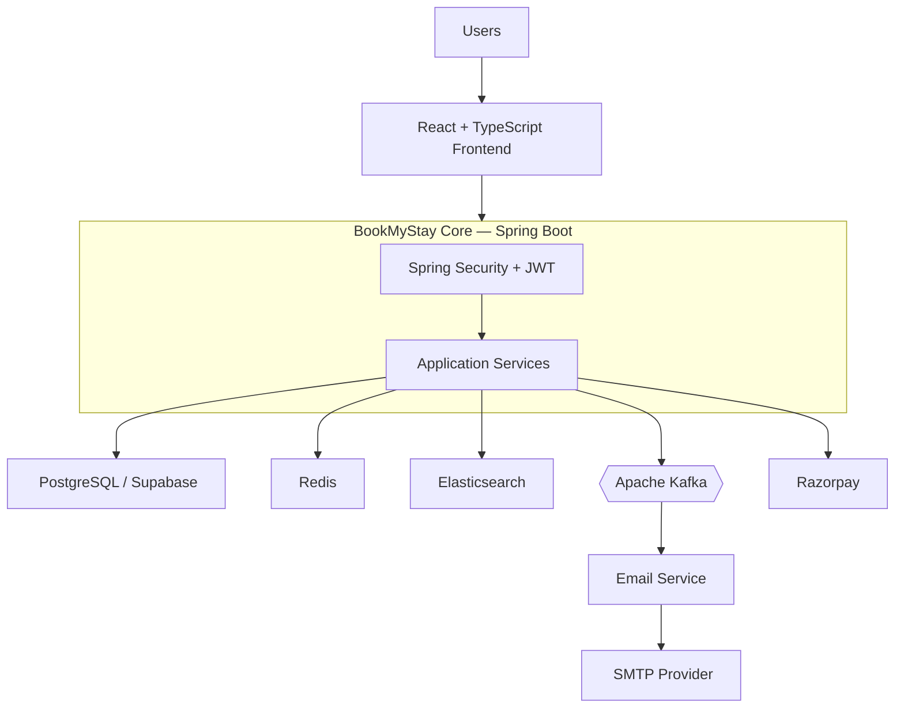

The detailed architecture is intentionally documented separately so this README stays approachable.

See [️ Architecture](docs/ARCHITECTURE.md).

---

# ️ Technology Stack

| Layer | Technology | Purpose |
|---|---|---|
| Backend Language | Java 21 | Backend development |
| Backend Framework | Spring Boot 3 | REST APIs and application services |
| Security | Spring Security | Authentication and authorization |
| Authentication | JWT | Stateless authentication |
| ORM | Spring Data JPA | Database persistence |
| Database | PostgreSQL | Primary relational database |
| Database Hosting | Supabase | Hosted PostgreSQL |
| Cache | Redis | Caching |
| Search | Elasticsearch | Hotel search |
| Messaging | Apache Kafka | Event-driven communication |
| Email | JavaMailSender | Email notifications |
| Payments | Razorpay | Online payments |
| API Documentation | Swagger / OpenAPI | API exploration and documentation |
| Containerization | Docker | Application and infrastructure containers |
| Frontend | React + TypeScript | User interface |
| Build Tool | Maven | Java dependency and build management |

---

# Authentication & Authorization

BookMyStay uses **Spring Security with JWT-based authentication** and supports:

```text
USER
OWNER
ADMIN
```

High-level flow:

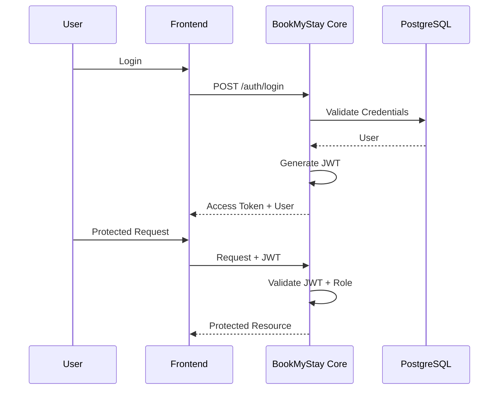

Authentication and authorization are enforced by the backend.

---

# Inventory Management

BookMyStay maintains daily room inventory.

Inventory tracks:

```text
Room
Hotel
City
Date
Book Count
Reserved Count
Total Count
Surge Factor
Price
Closed
```

Availability is calculated as:

```text
Available Rooms
=
Total Count
-
Book Count
-
Reserved Count
```

This allows inventory to be held while a booking is going through payment.

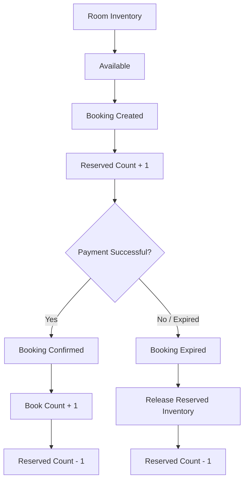

---

# Hotel Search

Elasticsearch is used for hotel search functionality.

The hotel search document contains information such as:

```text
Hotel ID
Hotel Name
City
Price
Ratings
Review Count
Active Status
Thumbnail
```

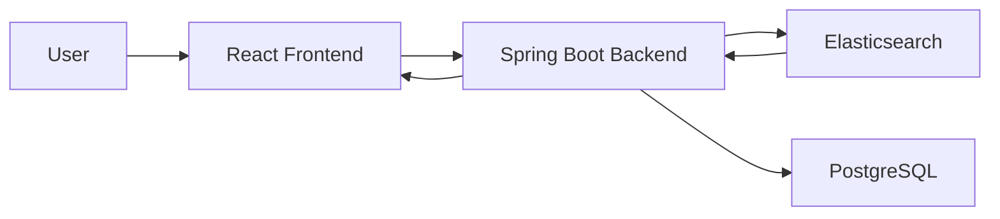

---

# Redis Caching

Redis is used as a caching layer to reduce repeated database operations and improve application performance.

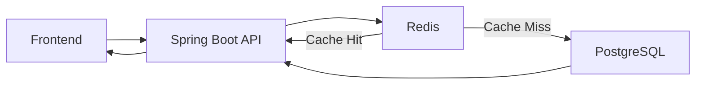

---

# Event-Driven Architecture

BookMyStay uses **Apache Kafka** for asynchronous event processing.

The core backend publishes application events that can be consumed by independent services.

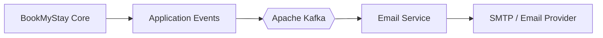

The `common-events` module contains shared event definitions used by the backend and email service.

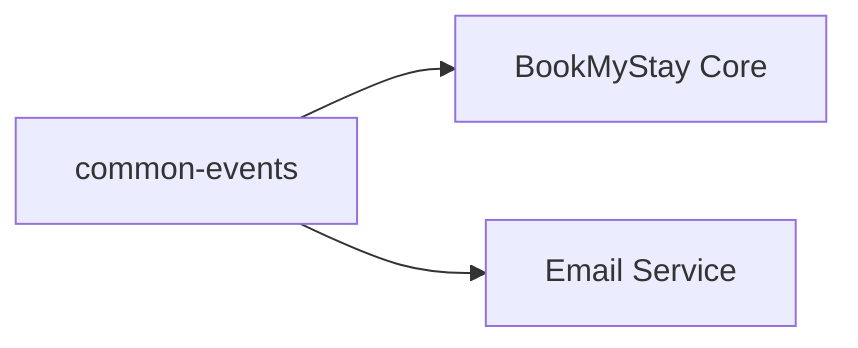

Detailed documentation: [ Event-Driven Architecture](docs/EVENT-DRIVEN-ARCHITECTURE.md).

---

# Email Service

BookMyStay contains a separate email service responsible for processing notification events and sending emails.

```text
BookMyStay Core
      │
      ▼
    Kafka
      │
      ▼
 Email Service
      │
      ▼
 JavaMailSender
      │
      ▼
 SMTP Provider
      │
      ▼
  User Email
```

The email service consumes Kafka events, builds notification messages, and sends them independently from the core backend.

---

# ️ Database

The application uses **PostgreSQL** as its primary relational database and **Supabase PostgreSQL** for hosted database infrastructure.

Major domain areas include:

```text
Users
Hotels
Rooms
Inventory
Bookings
Payments
Guests
Reviews
```

Detailed database documentation: [️ Database Documentation](docs/DATABASE.md).

---

# Docker

The backend repository contains Docker configuration for the application and infrastructure.

```text
Dockerfile
docker-compose.yml
email-service/Dockerfile
```

Docker Compose is used for infrastructure such as:

- Apache Kafka
- Elasticsearch

Start infrastructure:

```bash
docker compose up -d
```

Check containers:

```bash
docker ps
```

Stop infrastructure:

```bash
docker compose down
```

---

# Run Locally

## 1. Clone the Repository

```bash
git clone https://github.com/gittarsem/BookMyStay.git
cd BookMyStay
```

## 2. Start Infrastructure

```bash
docker compose up -d
```

## 3. Build the Project

```bash
mvn clean install
```

## 4. Run BookMyStay Core

```bash
cd bookmystay-core
mvn spring-boot:run
```

## 5. Run Email Service

Open another terminal:

```bash
cd email-service
mvn spring-boot:run
```

---

# ️ Environment Configuration

The application requires environment-specific configuration for external services.

Typical configuration categories include:

```text
PostgreSQL / Supabase
JWT
Redis
Elasticsearch
Kafka
Razorpay
SMTP
```

Create the required environment variables according to your local or deployment configuration.

> ️ Never commit production secrets, passwords, API keys, JWT secrets, Razorpay credentials, or SMTP credentials to GitHub.

---

# API Documentation

The backend exposes REST APIs through Spring Boot.

Swagger/OpenAPI is used for API exploration and documentation.

When the backend is running locally, Swagger UI is available through:

```text
/swagger-ui/index.html
```

---

# Booking & Payment States

## Booking

```text
payment_pending
      │
      ├── Payment Successful
      │        ↓
      │      Booked
      │
      └── Payment Failed / Expired
               ↓
           Cancelled
```

## Payment

```text
pending
completed
failed
expired
refund
```

Payment and booking status are maintained separately so payment processing can remain independent from the booking lifecycle.

---

# Security

The application uses:

- Spring Security
- JWT authentication
- Role-based authorization
- Password hashing
- Protected APIs
- Payment signature verification
- Environment-based secret configuration

Sensitive values should always be stored using environment variables or secure secret management.

---

# Scalability

The architecture separates major infrastructure responsibilities:

```text
                 ┌────────────────────┐
                 │   React Frontend   │
                 └─────────┬──────────┘
                           │
                           ▼
                 ┌────────────────────┐
                 │   Spring Boot API  │
                 └─────────┬──────────┘
                           │
            ┌──────────────┼─────────────────┐
            │              │                 │
            ▼              ▼                 ▼
       PostgreSQL        Redis         Elasticsearch
            │
            ▼
          Kafka
            │
            ▼
       Email Service
```

This separation allows infrastructure components and asynchronous services to evolve independently.

---

# Project Documentation

| Document | Description |
|---|---|
| [️ Architecture](docs/ARCHITECTURE.md) | Backend architecture and system structure |
| [️ Database](docs/DATABASE.md) | Database structure and relationships |
| [ Booking Flow](docs/BOOKING-FLOW.md) | Complete booking lifecycle |
| [ Payment Flow](docs/PAYMENT-FLOW.md) | Razorpay payment lifecycle |
| [ Event-Driven Architecture](docs/EVENT-DRIVEN-ARCHITECTURE.md) | Kafka and email service |
| [ Deployment](docs/DEPLOYMENT.md) | Deployment architecture and setup |
| [ Demo](docs/DEMO.md) | Demo accounts and testing |
| [ Pages](docs/PAGES.md) | Application pages and screenshots |

---

# ️ Frontend

The BookMyStay frontend is maintained in a separate repository.

### Frontend Repository

https://github.com/gittarsem/BookMyStay-Frontend

### Live Frontend

https://bookmystay-frontend-one.vercel.app

### Frontend Stack

- React 19
- TypeScript
- Vite
- Tailwind CSS
- React Query
- React Hook Form
- Zod
- Axios
- Lucide Icons
- Razorpay JavaScript SDK

---

# ️ Future Improvements

Potential future improvements include:

- Advanced hotel filtering
- Hotel recommendation engine
- Advanced dynamic pricing
- Improved inventory locking
- Payment webhooks
- Distributed tracing
- Centralized logging
- Monitoring and observability
- Rate limiting
- API gateway
- Service discovery
- Automated CI/CD
- Kubernetes deployment
- Horizontal service scaling
- Advanced analytics
- SMS notifications
- Push notifications

---

# ‍ Author

**Tarsem Gulab**

B.Tech — Computer Science & Engineering

**IIIT Una**

---

# ⭐ Support

If you find the project useful or interesting, consider giving the repository a ⭐ on GitHub.

<p align="center">
  <b>BookMyStay — Discover. Book. Stay.</b>
</p>
