# 🏗️ BookMyStay — System Architecture

> **Scope:** This document explains how the BookMyStay system is structured, how requests move through the backend layers, and how the core application connects to supporting infrastructure.
>
> Detailed implementation flows are intentionally kept in their respective documents. See the links at the end of this file.

---

## 1. Architecture at a Glance

BookMyStay follows a **layered Spring Boot architecture** inside the main backend, with selected supporting services and infrastructure separated around it.

The main request path is:

```text
React Frontend
      │
      ▼
Spring Security + JWT
      │
      ▼
Controller
      │
      ▼
Service
      │
      ▼
Repository
      │
      ▼
Entity / PostgreSQL
```

The service layer can also communicate with infrastructure that serves specialized purposes:

```text
                         ┌──► Redis
                         │
                         ├──► Elasticsearch
                         │
Service Layer ───────────┼──► Razorpay
                         │
                         ├──► Cloudinary
                         │
                         └──► Kafka
                                  │
                                  ▼
                            Email Service
```

This separation keeps **business logic inside the application layer** while specialized infrastructure handles caching, search, payments, media, and asynchronous communication.

---

# 2. High-Level System Architecture

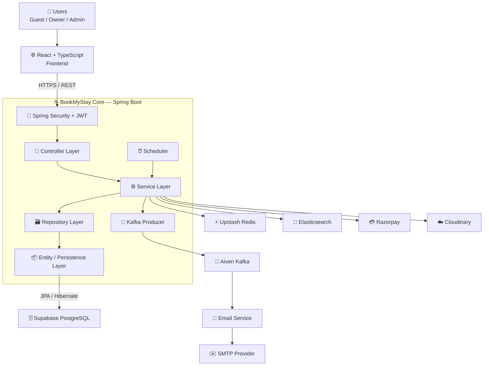

### Architectural boundary

The diagram can be divided into three logical areas:

| Area | Responsibility |
|---|---|
| **Client** | User interaction and presentation |
| **BookMyStay Core** | Authentication, authorization, business rules and persistence orchestration |
| **Supporting infrastructure** | Specialized capabilities such as caching, search, payments, messaging and email |

---

# 3. Backend Layered Architecture

The core backend follows a conventional layered architecture.

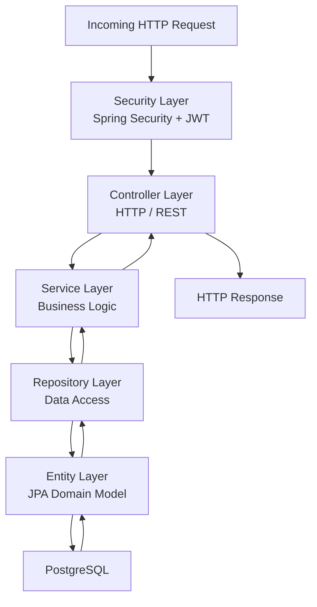

## Responsibility of each layer

### Security Layer

Responsible for:

- JWT authentication
- Request authentication
- Role-based authorization
- Protecting secured endpoints

The frontend does not directly determine whether an operation is authorized. The backend enforces authorization.

### Controller Layer

Responsible for:

- Receiving HTTP requests
- Validating request-level input
- Calling the appropriate service
- Returning HTTP responses

Controllers should not contain the application's core business rules.

### Service Layer

Responsible for:

- Business rules
- Booking logic
- Inventory operations
- Payment orchestration
- Owner/admin operations
- Review rules
- Coordination between repositories and external services

This is the primary application/business layer.

### Repository Layer

Responsible for:

- Database access
- JPA queries
- Persistence operations
- Retrieving domain data

### Entity Layer

Represents the persistent domain model used by the application and Hibernate/JPA.

---

# 4. Request Lifecycle

A normal synchronous API request follows this path:

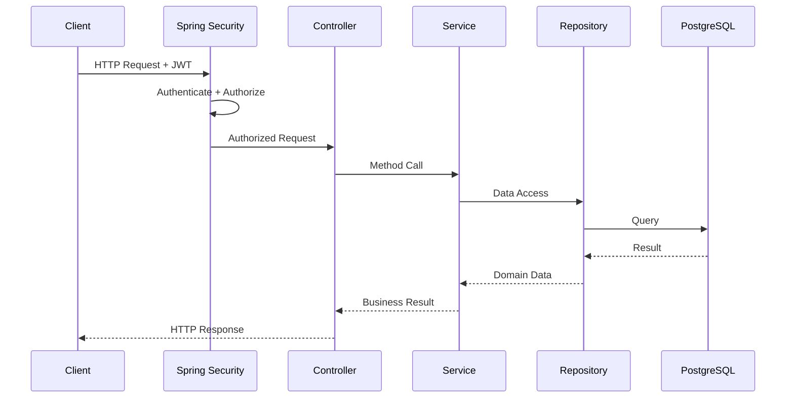

This is the **default application flow**.

External infrastructure is invoked by the service layer only when the use case requires it.

---

# 5. Application Package Structure

The current backend separates responsibilities into packages such as:

```text
com.tarsem.BookMyStay
│
├── Config/
├── Controller/
├── Entity/
├── Enums/
├── Exceptions/
├── Repositroy/
├── Scheduler/
├── Security/
├── Service/
├── Strategy/
├── Utils/
├── constants/
├── document/
├── dto/
└── producer/
```

Conceptually:

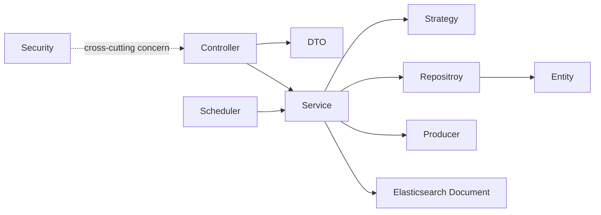

> Package names above follow the current repository structure. `Repositroy` is retained because that is the package name currently present in the project.

---

# 6. Controller → Service → Repository Flow

A typical business operation follows:

```text
HTTP Request
     │
     ▼
Controller
     │
     │  request DTO
     ▼
Service
     │
     ├── validate business rules
     ├── coordinate operations
     ├── call external services when required
     │
     ▼
Repository
     │
     ▼
PostgreSQL
```

The important design rule is:

> **Controllers handle HTTP concerns; services handle business concerns; repositories handle persistence concerns.**

This makes individual responsibilities easier to test, maintain and extend.

---

# 7. Infrastructure Integration

The service layer acts as the application boundary for specialized infrastructure.

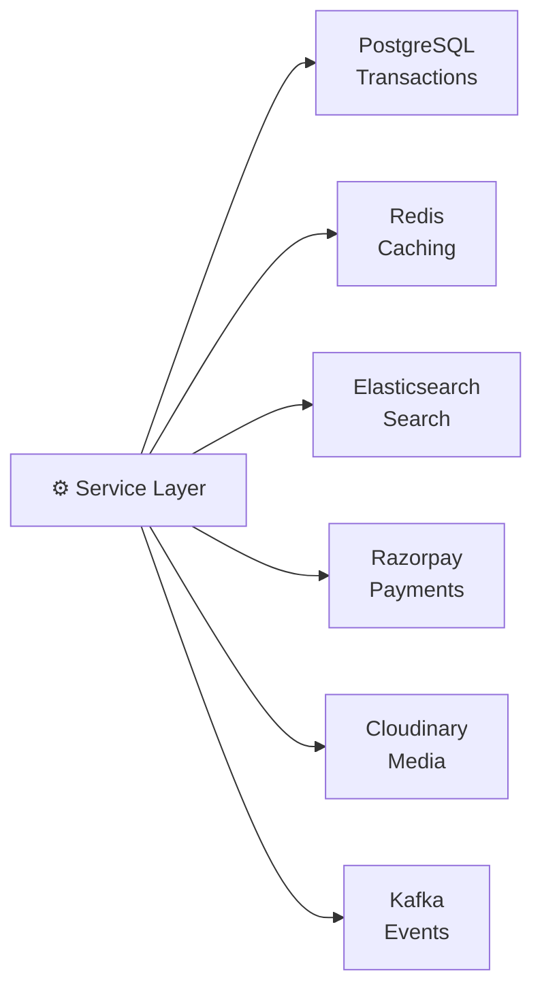

Each system has one primary responsibility:

| Component | Architectural Responsibility |
|---|---|
| PostgreSQL | Transactional persistence |
| Redis | Cache |
| Elasticsearch | Search index |
| Razorpay | Payment gateway |
| Cloudinary | Media storage |
| Kafka | Asynchronous event transport |

Detailed infrastructure and hosting information belongs in [`DEPLOYMENT.md`](./DEPLOYMENT.md).

---

# 8. PostgreSQL — System of Record

PostgreSQL is the primary persistence layer.

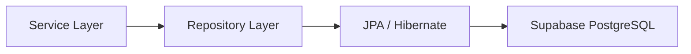

Transactional application data remains in PostgreSQL.

The architecture therefore treats PostgreSQL as the **source of truth for transactional state**, while other systems provide specialized capabilities.

Database entities and relationships are documented separately in [`DATABASE.md`](./DATABASE.md).

---

# 9. Redis — Cache Layer

Redis sits beside the primary database rather than replacing it.

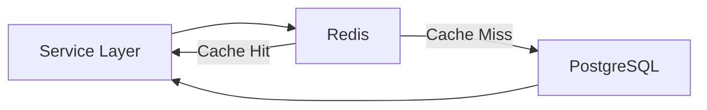

Conceptually this follows a cache-aside pattern:

```text
Request
   │
   ▼
Check Redis
   │
   ├── Hit ──► Return cached data
   │
   └── Miss
          │
          ▼
      PostgreSQL
          │
          ▼
      Cache result
```

Redis deployment details are documented in [`DEPLOYMENT.md`](./DEPLOYMENT.md).

---

# 10. Elasticsearch — Search Boundary

Elasticsearch is separated from transactional persistence.

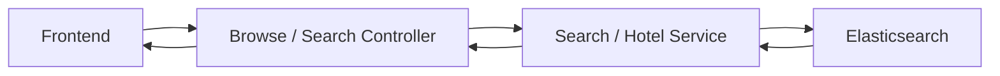

The important architectural distinction is:

```text
PostgreSQL
    │
    └── Transactional application data

Elasticsearch
    │
    └── Search-oriented representation
```

Elasticsearch therefore does not replace PostgreSQL as the transactional database.

Search implementation details belong in the relevant search/database documentation.

---

# 11. Payment Integration Boundary

Razorpay is an external system.

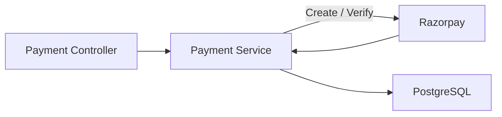

The application owns the booking/payment state, while Razorpay handles payment processing.

The detailed payment lifecycle is documented in [`PAYMENT-FLOW.md`](./PAYMENT-FLOW.md).

---

# 12. Event-Driven Boundary

Kafka is used where the operation can be processed asynchronously.

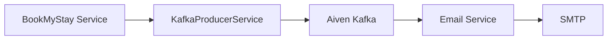

The architectural flow is:

```text
Business Operation
       │
       ▼
Publish Event
       │
       ▼
Kafka
       │
       ▼
Email Service
       │
       ▼
SMTP
```

This keeps email delivery outside the synchronous request path.

The complete event architecture is documented in [`EVENT-DRIVEN-ARCHITECTURE.md`](./EVENT-DRIVEN-ARCHITECTURE.md).

---

# 13. Email Service Boundary

The Email Service is a separate Spring Boot application.

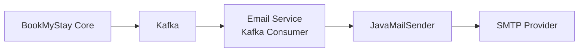

The core application does not need to perform SMTP delivery during the main API request.

This creates a clear boundary:

```text
BookMyStay Core
      │
      │ event
      ▼
    Kafka
      │
      ▼
 Email Service
      │
      ▼
    SMTP
```

See [`EVENT-DRIVEN-ARCHITECTURE.md`](./EVENT-DRIVEN-ARCHITECTURE.md) for topics, consumers and event flows.

---

# 14. Scheduler Boundary

Scheduled processing is part of the application layer.

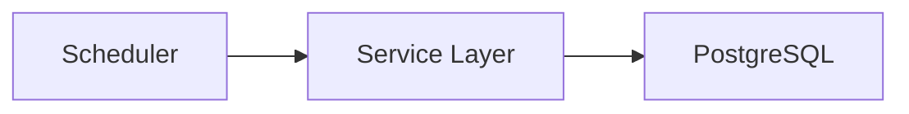

The scheduler triggers application operations rather than directly manipulating the database.

For example, expiration-related processing can follow:

```text
Scheduler
   │
   ▼
Service
   │
   ├── identify expired state
   ├── update booking state
   └── release related inventory
```

The detailed booking lifecycle is documented in [`BOOKING-FLOW.md`](./BOOKING-FLOW.md).

---

# 15. Cross-Cutting Concerns

Some components do not belong to a single request layer.

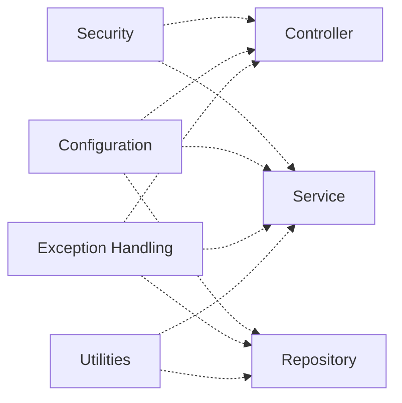

These concerns support the application without becoming part of the primary business-flow chain.

---

# 16. End-to-End Architecture Flow

This is the complete conceptual flow without exposing implementation details that belong in other documents.

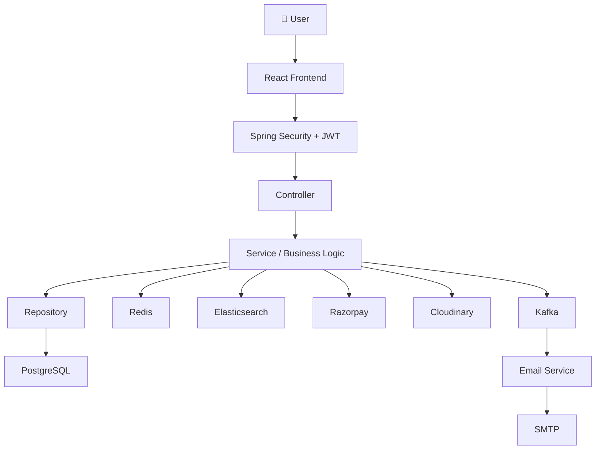

---

# 17. Architectural Communication Rules

The main communication boundaries can be summarized as:

```text
Frontend
   │
   │ REST / HTTPS
   ▼
Controller
   │
   │ method calls
   ▼
Service
   │
   ├──► Repository ──► PostgreSQL
   │
   ├──► Redis
   │
   ├──► Elasticsearch
   │
   ├──► Razorpay
   │
   ├──► Cloudinary
   │
   └──► Kafka ──► Email Service ──► SMTP
```

### Key rule

**Business logic stays in the Service layer.**

The surrounding systems are specialized dependencies rather than replacements for the service layer.

---

# 18. Architecture Decisions

| Decision | Reason |
|---|---|
| Layered backend | Separates HTTP, business and persistence responsibilities |
| PostgreSQL for transactions | Reliable relational persistence |
| Redis beside PostgreSQL | Fast access without replacing persistent storage |
| Elasticsearch for search | Separates search workloads from transactional queries |
| Kafka for asynchronous events | Decouples background consumers from API requests |
| Separate Email Service | Isolates notification delivery |
| JWT + Spring Security | Stateless API authentication and role-based authorization |
| Dockerized services | Consistent application packaging |
| Managed infrastructure | Separates application deployment from infrastructure operations |

Deployment-specific provider choices are documented in [`DEPLOYMENT.md`](./DEPLOYMENT.md).

---

# 19. Where to Read Next

This document intentionally does **not** duplicate detailed implementation flows.

| Topic | Documentation |
|---|---|
| Database entities and relationships | [`DATABASE.md`](./DATABASE.md) |
| Booking lifecycle | [`BOOKING-FLOW.md`](./BOOKING-FLOW.md) |
| Razorpay payment lifecycle | [`PAYMENT-FLOW.md`](./PAYMENT-FLOW.md) |
| Kafka and Email Service | [`EVENT-DRIVEN-ARCHITECTURE.md`](./EVENT-DRIVEN-ARCHITECTURE.md) |
| Production infrastructure and hosting | [`DEPLOYMENT.md`](./DEPLOYMENT.md) |
| Application pages/features | [`PAGES.md`](./PAGES.md) |
| Demo accounts | [`DEMO.md`](./DEMO.md) |

---

## 20. Interview Summary

A concise explanation of the architecture is:

> **BookMyStay uses a layered Spring Boot architecture. Requests enter through Spring Security and the controller layer, business rules are handled by services, and persistence is handled through Spring Data repositories and PostgreSQL. Redis provides caching and Elasticsearch handles search workloads. External integrations such as Razorpay and Cloudinary are accessed from the application layer. Kafka is used for asynchronous events, with a separate Email Service consuming those events and delivering notifications through SMTP.**

The architecture can therefore be remembered as:

```text
              ┌───────────────┐
              │ React Frontend│
              └───────┬───────┘
                      │
                      ▼
              ┌───────────────┐
              │ Security/JWT  │
              └───────┬───────┘
                      │
                      ▼
              ┌───────────────┐
              │  Controller   │
              └───────┬───────┘
                      │
                      ▼
              ┌───────────────┐
              │    Service    │
              └───────┬───────┘
                      │
             ┌────────┼────────┐
             ▼        ▼        ▼
        Repository  Redis   Search
             │               │
             ▼               ▼
        PostgreSQL      Elasticsearch

                 Service
                    │
          ┌─────────┼─────────┐
          ▼         ▼         ▼
      Razorpay  Cloudinary  Kafka
                              │
                              ▼
                        Email Service
                              │
                              ▼
                             SMTP
```
