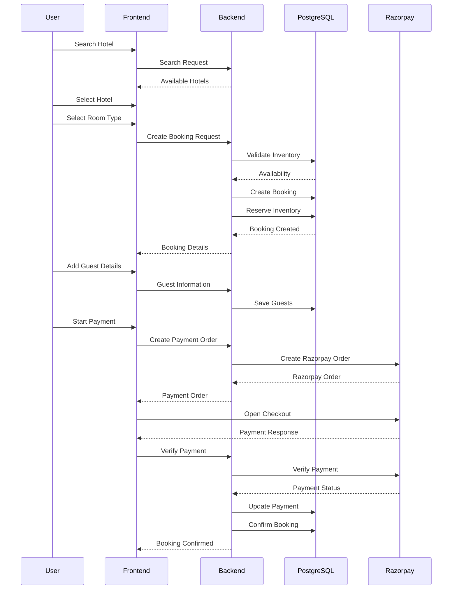
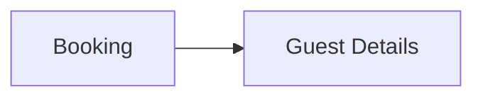
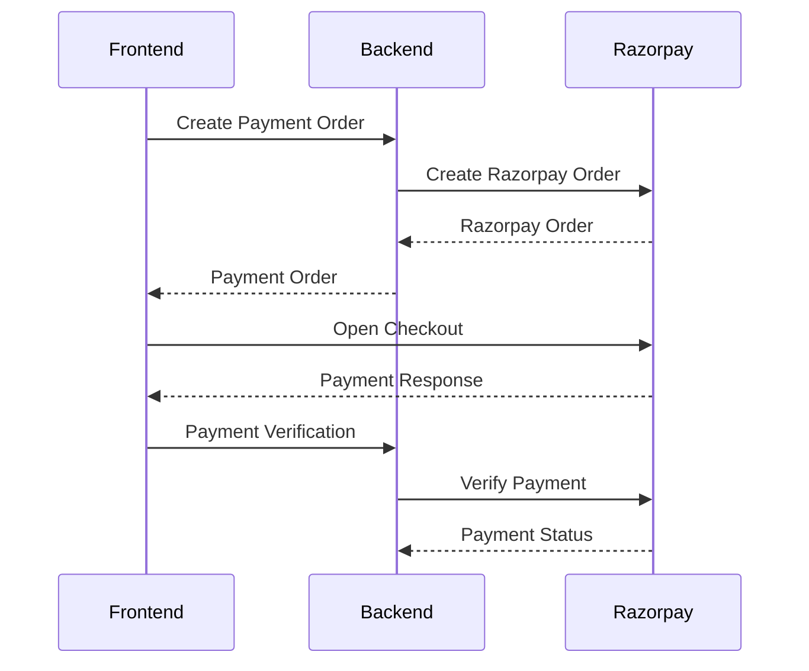
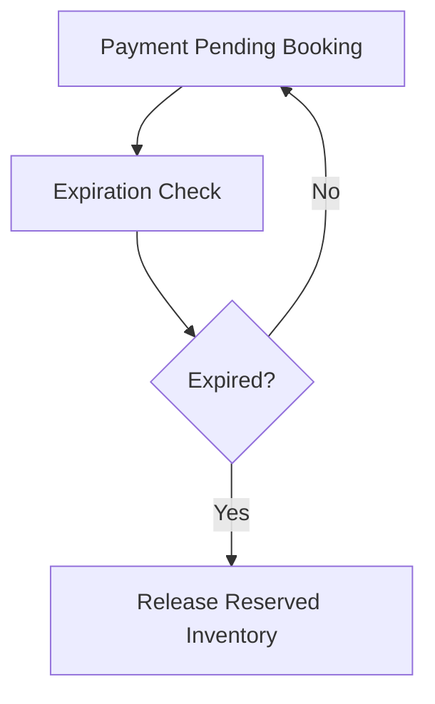
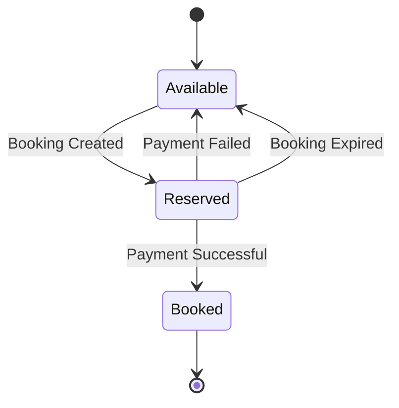
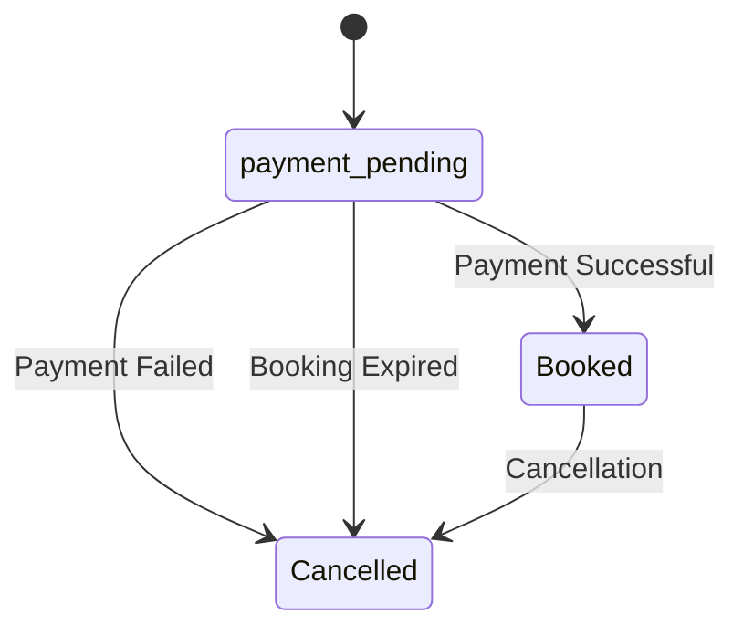

# 🔄 BookMyStay — Booking Flow

## 📌 Overview

The booking flow describes how a user moves from selecting a hotel and room type to creating a booking, reserving inventory, adding guests, and completing payment.

---

## 🧭 Complete Booking Flow



---

## 🔎 1. Hotel Selection

The user searches for available hotels using:

```text
City
Check-in Date
Check-out Date
Guests
```

The frontend sends the search request to the backend and receives the available hotel results.

The user then selects:

```text
Hotel
Room Type
Number of Guests
```

---

## 📦 2. Inventory Validation

Before creating the booking, the backend checks the inventory for the requested room type and dates.

Availability is calculated as:

```text
Available
=
Total Count
-
Book Count
-
Reserved Count
```

The booking can proceed only when the requested inventory is available.

---

## 📝 3. Booking Creation

After successful inventory validation:

```text
Booking Request
       │
       ▼
Inventory Validation
       │
       ▼
Booking Created
       │
       ▼
Inventory Reserved
       │
       ▼
Payment Pending
```

The booking is initially maintained in a payment-pending state while the reserved inventory is held.

---

## 👥 4. Guest Information

Guest details are associated with the booking.



The guest information is saved against the booking.

---

## 💳 5. Payment

Once the booking has been created, the frontend starts the payment process.



---

## ✅ 6. Successful Booking

After successful payment verification:

```text
Payment
pending
   │
   ▼
completed

Booking
payment_pending
   │
   ▼
Booked
```

The reserved inventory becomes booked inventory.

---

## ❌ 7. Failed Payment

If payment verification fails:

```text
Payment Pending
       │
       ▼
Payment Failed
       │
       ▼
Booking Cancelled / Expired
       │
       ▼
Reserved Inventory Released
```

---

## ⏱️ 8. Booking Expiration

Payment-pending bookings are checked for expiration.



---

## 📦 9. Inventory Lifecycle

The booking-related inventory lifecycle is:



---

## 🔄 Booking State Lifecycle



---

## 🔗 Related Documentation

- [Database](DATABASE.md) — Booking, inventory and payment data model
- [Payment Flow](PAYMENT-FLOW.md) — Detailed Razorpay payment verification
- [Architecture](ARCHITECTURE.md) — Overall system and backend architecture
