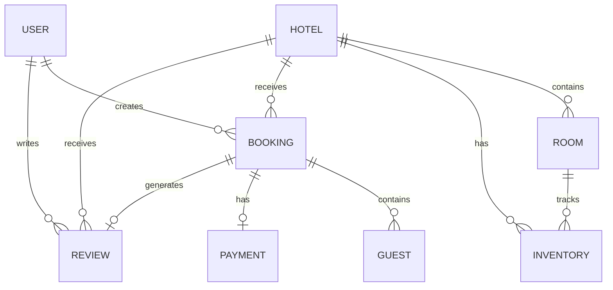
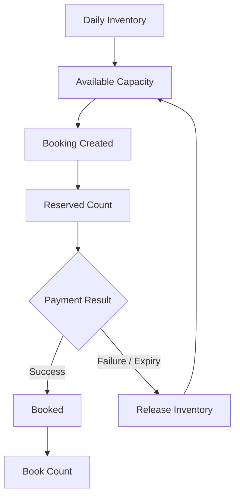
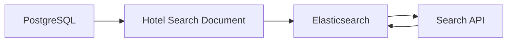

# 🗄️ BookMyStay — Database Documentation

## 📌 Overview

BookMyStay uses **PostgreSQL** as its primary relational database, with **Supabase** used for hosted PostgreSQL infrastructure.

The database supports users, hotels, rooms, inventory, bookings, payments, guests and reviews.

> This document describes the domain-level database design. Keep exact column definitions synchronized with the entity classes in `bookmystay-core`.

## 🧩 Main Domain Areas

```text
Users
Hotels
Rooms
Inventory
Bookings
Payments
Guests
Reviews
```

## 🏗️ Domain Relationship Overview



## 👤 User Domain

Users are the primary authenticated actors in the platform.

Supported roles:

```text
USER
OWNER
ADMIN
```

## 🏨 Hotel Domain

A hotel represents a property listed on BookMyStay.

Hotel-related concepts include:

```text
Hotel
City
Rating
Review Count
Active Status
Thumbnail
Rooms
Inventory
Bookings
Reviews
```

Hotel information is also represented in Elasticsearch for search operations.

## 🛏️ Room Domain

Rooms belong to hotels and define bookable accommodation characteristics.

The room domain includes:

```text
Hotel
Room Type
Capacity
Hourly Price
Daily Price
```

## 📦 Inventory Domain

Inventory tracks room availability by date.

Inventory concepts include:

```text
Room
Hotel
City
Date
Book Count
Reserved Count
Total Count
Surge Factor
Price
Closed
```

Availability:

```text
Available
=
Total Count
-
Book Count
-
Reserved Count
```

## 📅 Booking Domain

A booking represents a user's reservation request.

The booking process is based on:

```text
Hotel
Room Type
Check-in Date
Check-out Date
Adult Count
Child Count
Inventory Availability
```

Booking states include:

```text
payment_pending
Booked
Cancelled
```

## 💳 Payment Domain

Payment information is maintained separately from booking state.

Supported payment states:

```text
pending
completed
failed
expired
refund
```

## 👥 Guest Domain

Guest information is associated with a booking and is managed through the booking/guest flow.

## ⭐ Review Domain

Reviews connect users and booking experiences with hotels.

The application supports rating, comment, creation and editing of reviews.

## 🔄 Inventory and Booking Relationship



## 🔍 Elasticsearch Relationship



## 🗃️ Database Technology

| Technology | Purpose |
|---|---|
| PostgreSQL | Primary database |
| Supabase | Hosted PostgreSQL |
| Spring Data JPA | Persistence layer |
| Elasticsearch | Search index |
| Redis | Cache |

## 🔗 Related Documentation

- [Architecture](ARCHITECTURE.md)
- [Booking Flow](BOOKING-FLOW.md)
- [Payment Flow](PAYMENT-FLOW.md)
- [Deployment](DEPLOYMENT.md)
