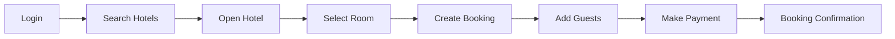
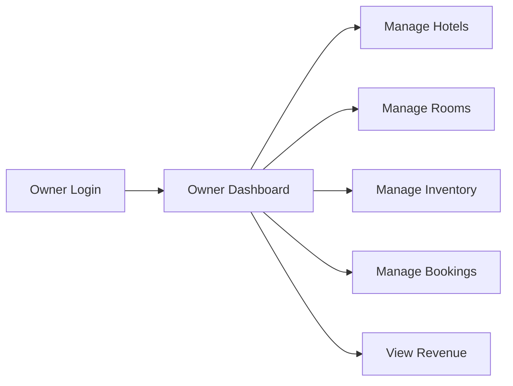
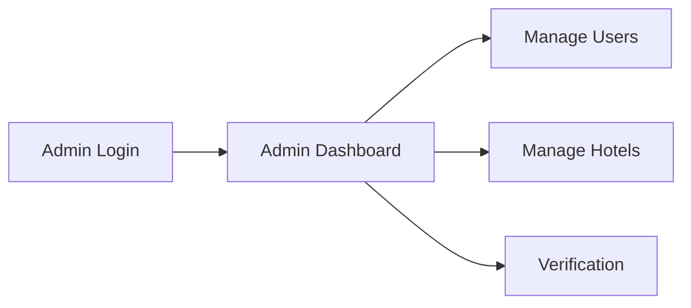

# 🔑 BookMyStay — Demo & Testing

## 📌 Overview

This document is intended for demo accounts and test credentials used to demonstrate BookMyStay.

> ⚠️ Do not place production credentials, API keys or payment secrets in this file.

## 👤 Guest Account

```text
Email: tarsemgulab2006@gmail.com
Password: @tarsem006
Role: USER
```

## 🏨 Owner Account

```text
Email: owner@bookmystay.com
Password: @tarsem006
Role: OWNER
```

## 🛡️ Admin Account

```text
Email: admin.tg@bookmystay.com
Password: admin@tg
Role: ADMIN
```

## 💳 Payment Testing

Use Razorpay's test environment for demonstration.

Do not use real payment credentials for development testing.

## 🧪 Guest Demo Flow



## 🏨 Owner Demo Flow



## 🛡️ Admin Demo Flow



## 🔒 Credential Safety

Before publishing:

- Replace placeholders with intentionally created demo accounts.
- Do not use personal accounts.
- Do not publish production passwords.
- Do not publish database credentials.
- Do not publish JWT secrets.
- Do not publish Razorpay secret keys.
- Do not publish SMTP passwords.

## 🔗 Related Documentation

- [Architecture](ARCHITECTURE.md)
- [Booking Flow](BOOKING-FLOW.md)
- [Payment Flow](PAYMENT-FLOW.md)
- [Deployment](DEPLOYMENT.md)
