# 🚀 BookMyStay — Production Deployment Architecture

## 1. Deployment Overview

BookMyStay is deployed using a **managed-services + containerized-application** model.

The application layer is separated from managed infrastructure:

```text
Application Layer
├── React Frontend
├── BookMyStay Core
└── Email Service

Managed Infrastructure
├── Supabase PostgreSQL
├── Upstash Redis
├── Aiven Kafka
└── Elasticsearch

External Integrations
├── Razorpay
├── Cloudinary
└── Gmail SMTP
```

This keeps the deployment simple while avoiding the operational overhead of self-hosting every infrastructure component.

---

# 2. Actual Production Architecture

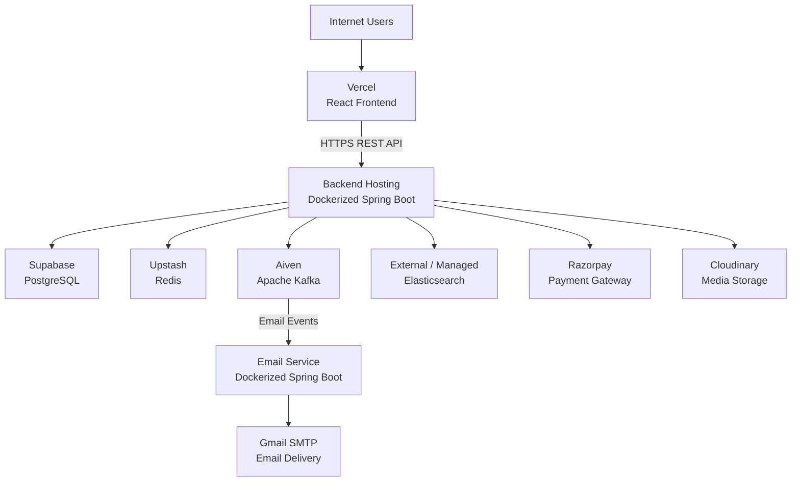

---

# 3. Deployment Layers

## Layer 1 — Client

```text
User Browser
     │
     ▼
Vercel
     │
     ▼
React Application
```

The frontend is responsible for:

- UI
- Routing
- Form handling
- API communication
- Authentication state
- Booking interaction
- Razorpay checkout interaction

---

## Layer 2 — Application

```text
                ┌──────────────────────┐
                │   Spring Boot Core   │
                │    REST Backend      │
                └──────────┬───────────┘
                           │
                           ▼
                ┌──────────────────────┐
                │    Email Service     │
                │   Spring Boot App    │
                └──────────────────────┘
```

The backend applications are packaged using Docker.

### BookMyStay Core

Responsible for:

- Authentication
- Authorization
- Hotel management
- Room management
- Inventory
- Booking
- Payments
- Reviews
- Search integration
- Event publishing

### Email Service

Responsible for:

- Kafka consumption
- Notification processing
- Email generation
- SMTP delivery

---

# 4. Database Deployment — Supabase

PostgreSQL is hosted on **Supabase**.

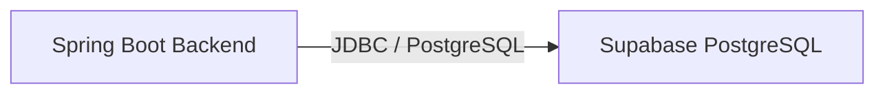

The backend configuration uses:

```properties
spring.datasource.url=${DB_URL}
spring.datasource.username=${DB_USERNAME}
spring.datasource.password=${DB_PASSWORD}
```

Supabase is the primary source of truth for transactional application data.

---

# 5. Redis Deployment — Upstash

Redis is hosted using **Upstash**.

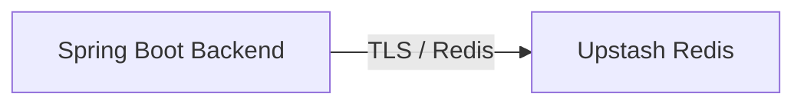

The backend configuration uses:

```properties
spring.data.redis.host=${REDIS_HOST}
spring.data.redis.port=${REDIS_PORT}
spring.data.redis.password=${REDIS_PASSWORD}
spring.data.redis.ssl.enabled=true
```

Redis is used as the application's caching layer.

---

# 6. Kafka Deployment — Aiven

Kafka is hosted using **Aiven**.

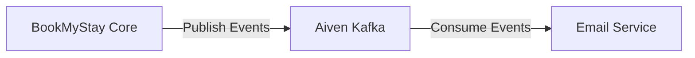

The deployed Kafka configuration uses environment variables for:

```text
KAFKA_BOOTSTRAP_SERVERS
KAFKA_SECURITY_PROTOCOL
KAFKA_SASL_MECHANISM
KAFKA_USERNAME
KAFKA_PASSWORD
KAFKA_TRUSTSTORE_LOCATION
```

This keeps Kafka credentials outside source code.

---

# 7. Elasticsearch Deployment

Elasticsearch is used as the search engine for hotel discovery.

The application receives the Elasticsearch endpoint through:

```properties
spring.elasticsearch.uris=${ES_URL}
```

Architecture:

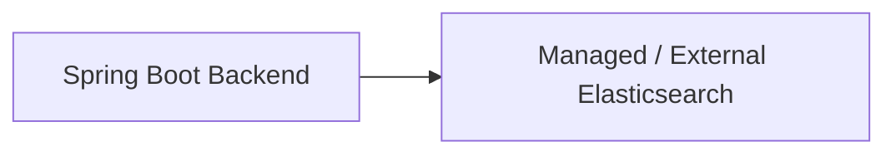

### Local Development

The repository also provides Elasticsearch through Docker Compose.

```yaml
elasticsearch:
  image: docker.elastic.co/elasticsearch/elasticsearch:9.2.6
```

Therefore:

```text
Local
  ↓
Docker Elasticsearch

Production
  ↓
External / Managed Elasticsearch
```

---

# 8. Email Service Deployment

The email service is independently containerized.

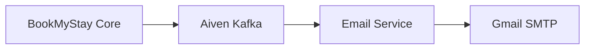

The email service uses:

```text
server.port=8081
```

and consumes Kafka events using the configured Kafka credentials.

---

# 9. Payment Deployment

Razorpay is an external payment gateway.

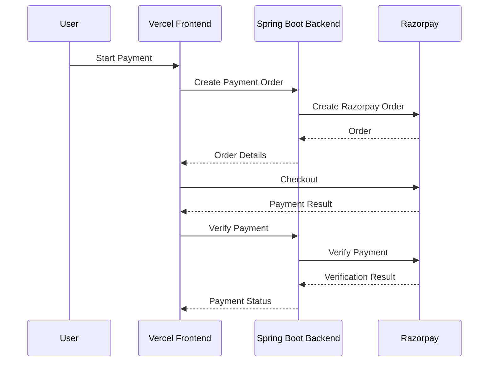

---

# 10. Cloudinary Deployment

Cloudinary handles application media/image storage.


Configuration:

```text
CLOUDINARY_CLOUD_NAME
CLOUDINARY_API_KEY
CLOUDINARY_API_SECRET
```

---

# 11. Complete Production Request Flow

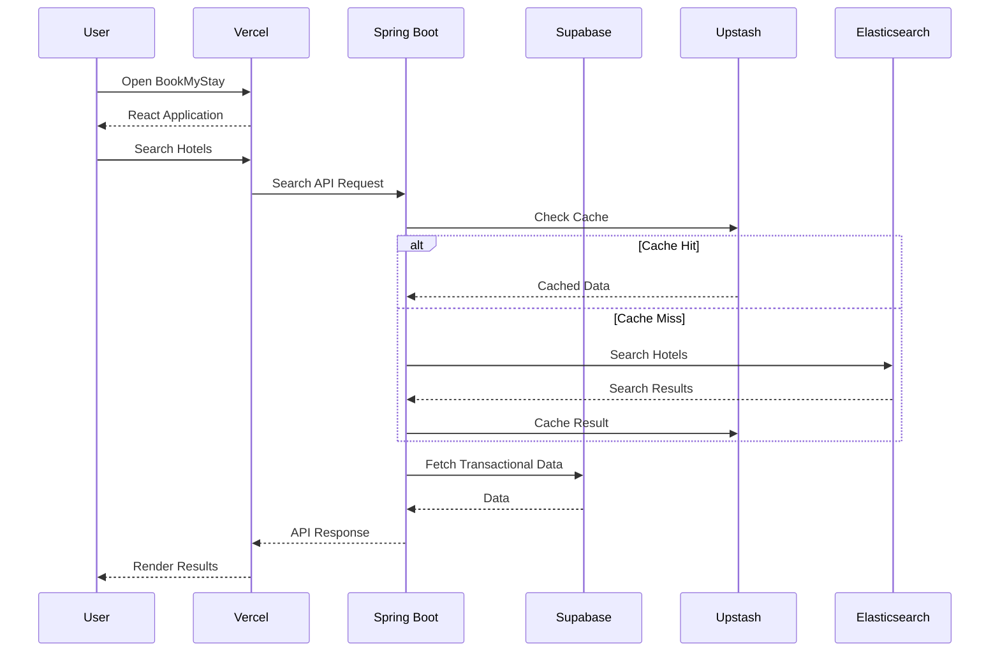

---

# 12. Complete Booking Deployment Flow

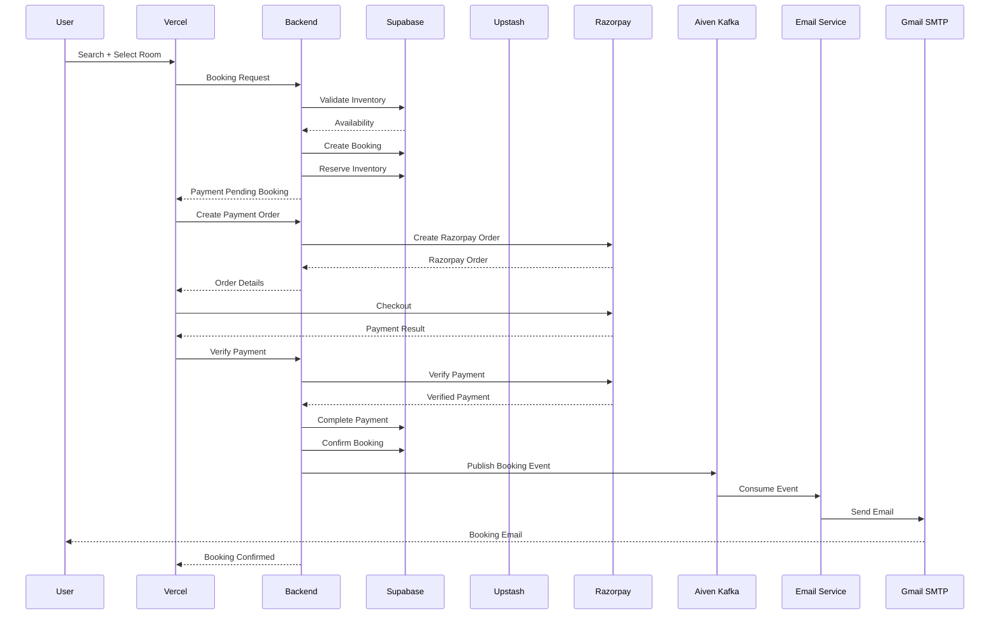

---

# 13. Local vs Production

## Local Development

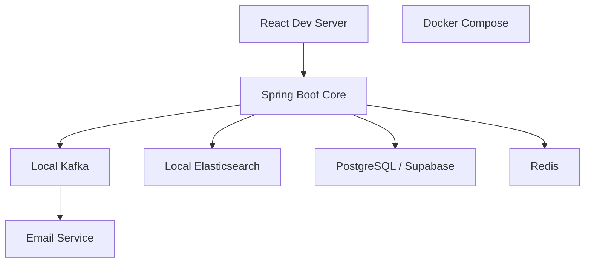

The repository's `docker-compose.yml` currently provides local:

- Kafka
- Elasticsearch

---

## Production

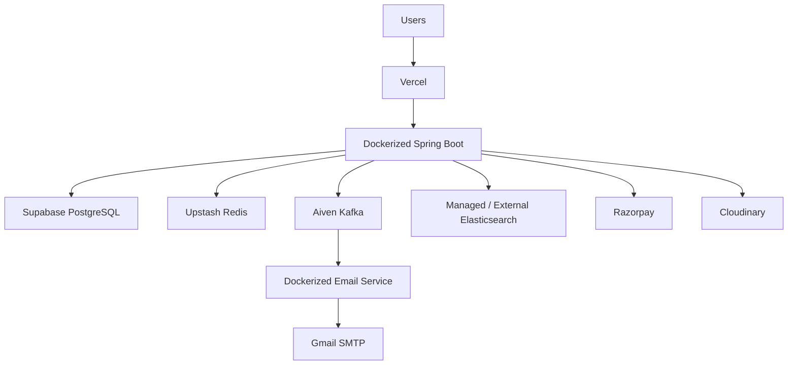

---

# 14. Environment Variables

The core backend currently expects environment-based configuration for:

```text
DB_URL
DB_USERNAME
DB_PASSWORD

JWT_SECRET

PORT
SPRING_PROFILES_ACTIVE

REDIS_HOST
REDIS_PORT
REDIS_PASSWORD

ES_URL

RAZORPAY_KEY_ID
RAZORPAY_KEY_SECRET
WEBHOOK_SECRET

KAFKA_BOOTSTRAP_SERVERS
KAFKA_SECURITY_PROTOCOL
KAFKA_SASL_MECHANISM
KAFKA_USERNAME
KAFKA_PASSWORD
KAFKA_TRUSTSTORE_LOCATION

CLOUDINARY_CLOUD_NAME
CLOUDINARY_API_KEY
CLOUDINARY_API_SECRET
```

The email service additionally uses:

```text
GMAIL_PASS

KAFKA_BOOTSTRAP_SERVERS
KAFKA_SECURITY_PROTOCOL
KAFKA_SASL_MECHANISM
KAFKA_USERNAME
KAFKA_PASSWORD
KAFKA_TRUSTSTORE_LOCATION
```

Never commit these values to GitHub.

---

# 15. Deployment Responsibilities

| Service | Hosted / Managed By | Role |
|---|---|---|
| Frontend | Vercel | React application |
| Backend | Container hosting | Spring Boot API |
| Email Service | Container hosting | Kafka consumer |
| PostgreSQL | Supabase | Primary database |
| Redis | Upstash | Cache |
| Kafka | Aiven | Event streaming |
| Elasticsearch | External / Managed | Search |
| Payments | Razorpay | Payment gateway |
| Images | Cloudinary | Media storage |
| Email | Gmail SMTP | Email delivery |

> The backend hosting provider should be kept aligned with the actual deployed environment. The repository itself defines a Dockerized Spring Boot application and does not hard-code a production hosting vendor.

---

# 16. Why Managed Infrastructure?

Instead of running every infrastructure component inside the application server:

```text
Bad operational model:

One Server
 ├── Backend
 ├── PostgreSQL
 ├── Redis
 ├── Kafka
 └── Elasticsearch
```

BookMyStay separates infrastructure:

```text
Backend
   │
   ├── Supabase PostgreSQL
   ├── Upstash Redis
   ├── Aiven Kafka
   └── Elasticsearch

Kafka
   │
   ▼
Email Service
```

Benefits:

- Independent scaling
- Managed backups
- Reduced operational overhead
- Isolated infrastructure failures
- Easier deployment
- Cleaner service boundaries
- Easier replacement of individual infrastructure components

---

# 17. Interview-Ready Explanation

Use this structure when explaining deployment in an interview:

> **"The BookMyStay frontend is deployed separately from the backend. The React application communicates with the Dockerized Spring Boot backend over HTTPS. PostgreSQL is hosted on Supabase and acts as the transactional source of truth. Redis is hosted on Upstash and is used for caching. Elasticsearch provides hotel search. Kafka is hosted on Aiven and is used for asynchronous event communication. The email service is a separate Spring Boot service that consumes Kafka events and sends emails through Gmail SMTP. Razorpay handles payments and Cloudinary handles media storage. Docker provides consistent packaging for the backend services, while managed infrastructure providers handle the stateful infrastructure."**

---

# 18. Architecture Principles

The system follows these core principles:

### Separation of Concerns

Each infrastructure component has a specific responsibility.

### Transactional Source of Truth

PostgreSQL remains the source of truth for business transactions.

### Search Separation

Elasticsearch is used for search rather than replacing PostgreSQL.

### Cache-aside Pattern

Redis is used as a caching layer around persistent data.

### Asynchronous Processing

Kafka decouples event consumers from the main request lifecycle.

### Stateless Backend

JWT authentication allows backend instances to remain stateless from an authentication perspective.

### Externalized Configuration

Secrets and environment-specific infrastructure endpoints are provided through environment variables.

### Containerization

Backend services are packaged with Docker for reproducible deployments.
