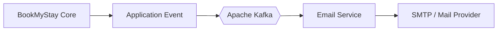
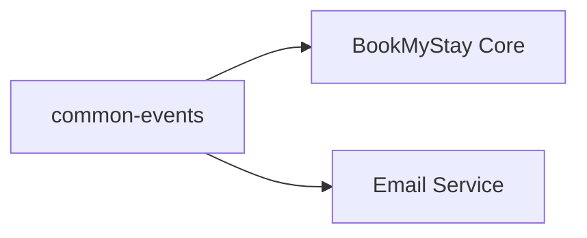
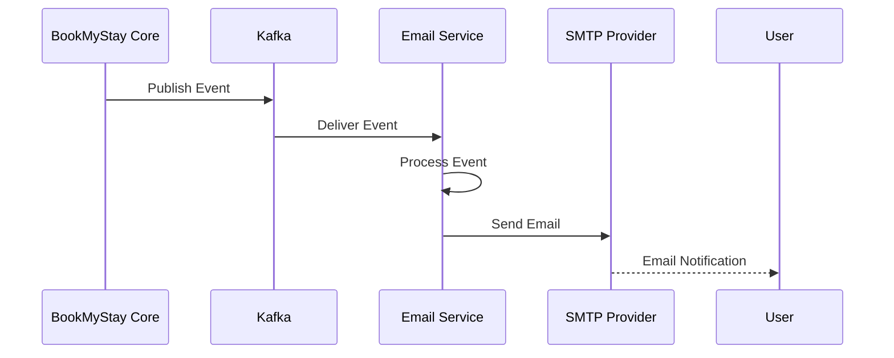
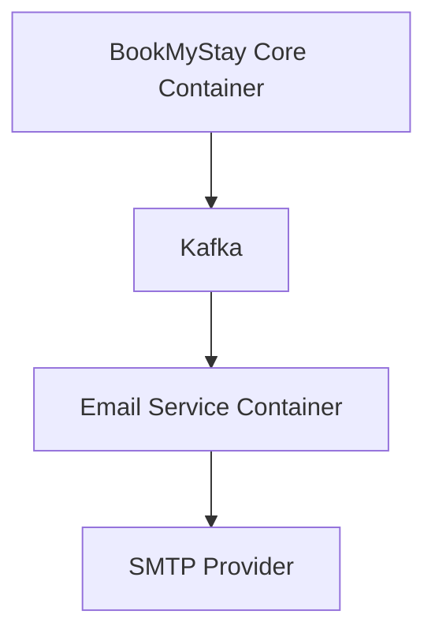

# 📨 BookMyStay — Event-Driven Architecture

## 📌 Overview

BookMyStay uses **Apache Kafka** for asynchronous event-driven communication.

The main documented use case is communication between BookMyStay Core and the dedicated Email Service.

## 🏗️ Event Architecture



## 🧩 Shared Event Module

The repository contains a `common-events` module.



## 📧 Email Processing Flow



## 🔄 Event Processing

```text
Synchronous Request
       │
       ▼
BookMyStay Core
       │
       ▼
Publish Event
       │
       ▼
Kafka
       │
       ▼
Email Service
       │
       ▼
Email Provider
```

## 🧱 Services

### BookMyStay Core

- Main business logic
- REST APIs
- Authentication
- Booking
- Inventory
- Payment
- Event publishing

### common-events

- Shared event definitions
- Shared event contracts

### Email Service

- Kafka event consumption
- Event processing
- Email creation
- JavaMailSender
- SMTP communication

## 📦 Repository Structure

```text
BookMyStay/
├── bookmystay-core/
├── common-events/
└── email-service/
    ├── src/
    ├── Dockerfile
    └── pom.xml
```

## 🐳 Service Deployment



## 🔐 Configuration

Kafka and SMTP configuration should be supplied through environment-specific configuration.

Never commit:

```text
SMTP passwords
SMTP API keys
Kafka credentials
Production secrets
```

## 🔗 Related Documentation

- [Architecture](ARCHITECTURE.md)
- [Deployment](DEPLOYMENT.md)
- [Database](DATABASE.md)
- [Booking Flow](BOOKING-FLOW.md)
