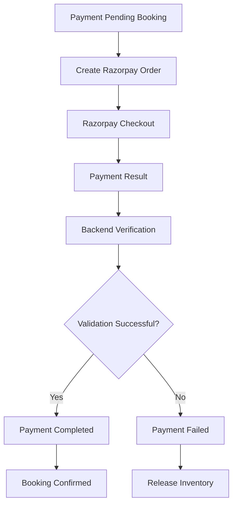
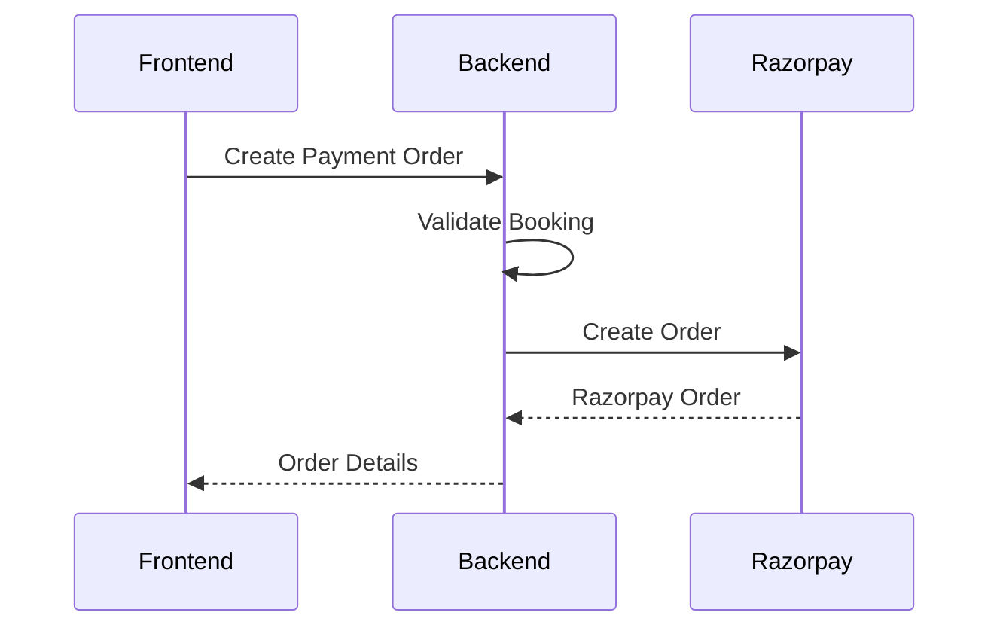
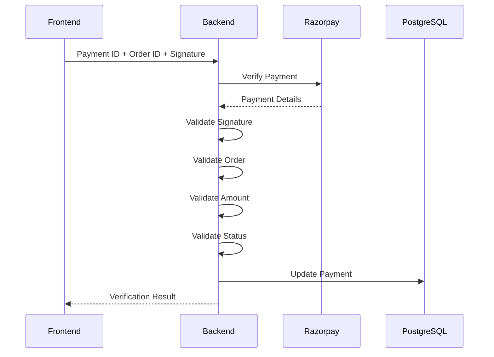
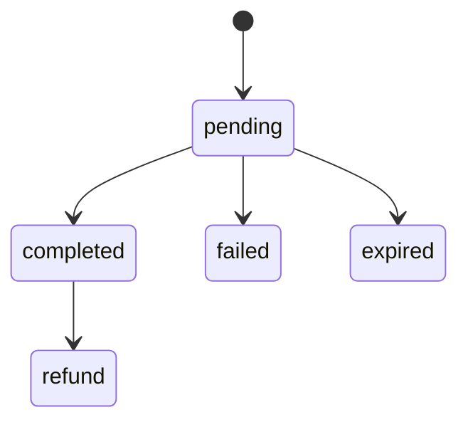

# 💳 BookMyStay — Payment Flow

## 📌 Overview

BookMyStay uses **Razorpay** for online payment processing.

The backend creates payment orders and validates payment results before confirming bookings.

## 🔄 Payment Lifecycle



## 1. Create Payment Order

```text
Frontend
   │
   ▼
Backend
   │
   ▼
Validate Booking
   │
   ▼
Razorpay
```

## 2. Razorpay Order



## 3. Checkout

```text
User
  │
  ▼
Frontend
  │
  ▼
Razorpay Checkout
  │
  ▼
Payment Result
```

## 4. Payment Verification

The frontend sends payment information to the backend.

The verification process validates:

```text
Payment ID
Order ID
Signature
Amount
Payment Status
```

## 🔐 Verification Flow



## ✅ Successful Payment

```text
Payment
pending
   ↓
completed

Booking
payment_pending
   ↓
Booked
```

## ❌ Failed Payment

```text
Payment
pending
   ↓
failed
```

## ⏳ Payment Expiration

Supported payment state:

```text
expired
```

## 💰 Refund State

Supported payment state:

```text
refund
```

## 🧾 Payment States



## 🔗 Related Documentation

- [Booking Flow](BOOKING-FLOW.md)
- [Architecture](ARCHITECTURE.md)
- [Database](DATABASE.md)
- [Deployment](DEPLOYMENT.md)
